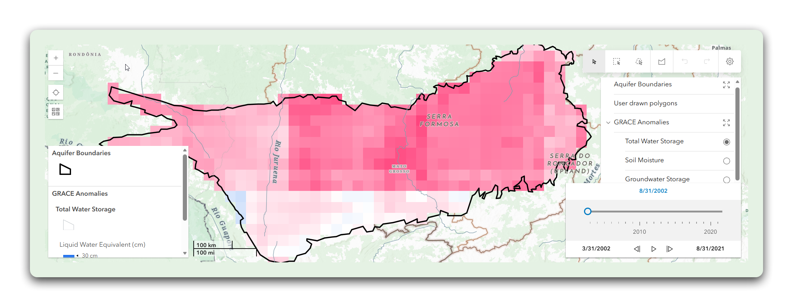
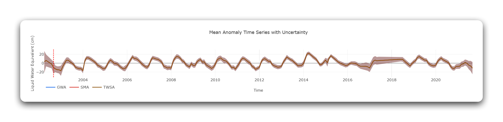

# Design Remake: GRACE Regional Groundwater Analyst

> Align the GRACE groundwater dashboard with the GEOGLOWS portal visual system.
> Reference: `apps.geoglows/DESIGN.md` ("The Field Station")

## Current State

**Tech stack:** Vanilla JS, Vite (rolldown-vite), ArcGIS JS SDK (`@arcgis/core` + `@arcgis/map-components`), Plotly.js, `@aquaveo/geoglows-auth`

**Current appearance:** The app uses ArcGIS's default Calcite Design System styling for the map and controls. The layer panel on the right uses Calcite's checkbox/radio toggles and default fonts. Charts render in Plotly.js with default styling. A date slider at the bottom uses Calcite's time slider component. The overall look is ArcGIS-native with no GEOGLOWS branding.

**What needs to change:** Typography, color palette, chart theming, panel styling, header treatment, and layer control restyling to match the portal while respecting ArcGIS component constraints.

---

## Design System Adoption

### Typography

| Element | Current | Proposed |
|---------|---------|----------|
| Chart titles | Plotly default (Open Sans) | Playfair Display, 400 weight |
| Axis labels | Plotly default | Inter, 0.75rem |
| Panel headings | Calcite default | Playfair Display, 400, text-xl |
| Layer labels | Calcite default | Inter, 0.875rem |
| Body text | Calcite default (Avenir Next) | Inter, 0.875rem |
| Button text | Calcite default | Inter, 600, 0.875rem |

**Font loading:** Same Google Fonts import as the portal.

**ArcGIS constraint:** Calcite components (`arcgis-map`, `arcgis-layer-list`) use Calcite's built-in `Avenir Next` font. Override at the CSS level where possible; accept Calcite defaults inside the map component itself.

### Color Palette

Same Workbench Palette as the portal. Key overrides for ArcGIS:

```css
:root {
  --calcite-color-brand: #2563eb;
  --calcite-color-brand-hover: #1d4ed8;
  --calcite-color-foreground-1: #ffffff;
  --calcite-color-foreground-2: #f8fafc;
  --calcite-color-text-1: #1e293b;
  --calcite-color-text-2: #475569;
  --calcite-color-text-3: #94a3b8;
  --calcite-color-border-1: #e2e8f0;
  --calcite-font-family: 'Inter', sans-serif;
}
```

**Dark mode:** Use Calcite's `calcite-mode-dark` class alongside the portal's `.dark` class, with matching overrides.

### Border Radius

ArcGIS Calcite uses its own radius system. Override where it doesn't conflict:

| Element | Value |
|---------|-------|
| Custom panels | `1rem` (rounded-2xl) |
| Custom buttons | `0.75rem` (rounded-xl) |
| Chart containers | `1rem` (rounded-2xl) |
| Calcite components | Keep Calcite defaults (they have their own radius system) |

---

## Component Redesign

### Header / Navigation Bar

**Current:** No branded header; the ArcGIS map fills the full viewport.

**Proposed:** Compact branded header above the map:
- GEOGLOWS droplet icon + "GRACE GROUNDWATER" wordmark (Inter bold, uppercase, tracking-wider)
- "Back to portal" link (text-sm, text-blue-600)
- Auth action slot from `@aquaveo/geoglows-auth`
- Theme toggle button
- `bg-white/80 dark:bg-slate-950/80` with `backdrop-blur-xl`
- Compact: `py-2 md:py-3` (the map needs maximum viewport space)

### Map Container

**Current:** Full-viewport ArcGIS map with Calcite-styled controls.

**Proposed:**
- Map fills below the compact header
- Keep ArcGIS native controls (zoom, compass, layer list) but override Calcite brand color to `#2563eb`
- The ArcGIS layer list panel should inherit portal border/surface colors via Calcite CSS custom properties


*Current: ArcGIS default with aquifer polygons and GRACE anomaly overlay*

### Layer Control Panel

**Current:** ArcGIS Calcite layer toggles on the right side with checkboxes for Aquifer Boundaries, User drawn polygons, GRACE Anomalies, Total Water Storage, Soil Moisture, Groundwater Storage.

**Proposed:**
- Keep the Calcite layer-list component for ArcGIS compatibility
- Override Calcite CSS variables to match portal colors
- Panel container: `bg-white/95 dark:bg-slate-900/95 backdrop-blur-sm border-l border-slate-200 dark:border-slate-800`
- Panel header: "Layers" in Playfair Display, text-lg
- Toggle descriptions in Inter, text-sm, text-slate-600

### Date / Time Slider

**Current:** Calcite time slider at the bottom of the map.

**Proposed:**
- Keep the Calcite time slider for ArcGIS compat
- Override brand color: `--calcite-color-brand: #2563eb`
- Container: `bg-white/90 dark:bg-slate-900/90 backdrop-blur-sm rounded-t-xl px-4 py-2`
- Date labels: Inter, text-xs, text-slate-500

### Chart Panel

**Current:** Plotly chart (Mean Anomaly Time Series) with default styling, displayed below or beside the map.

**Proposed Plotly layout overrides** (same as Hydroviewer):

```javascript
const portalPlotlyLayout = {
  font: {
    family: "'Inter', sans-serif",
    size: 12,
    color: '#475569',
  },
  title: {
    font: {
      family: "'Playfair Display', Georgia, serif",
      size: 18,
      weight: 400,
      color: '#1e293b',
    },
  },
  paper_bgcolor: '#ffffff',
  plot_bgcolor: '#ffffff',
  xaxis: {
    gridcolor: '#f1f5f9',
    linecolor: '#e2e8f0',
    tickfont: { size: 11, color: '#94a3b8' },
  },
  yaxis: {
    gridcolor: '#f1f5f9',
    linecolor: '#e2e8f0',
    tickfont: { size: 11, color: '#94a3b8' },
  },
  margin: { t: 48, r: 24, b: 48, l: 56 },
};
```

**Chart container:** Glass-card panel (`rounded-2xl p-4 border border-slate-200`). Title in Playfair Display. Time series line colors should use the portal palette: primary data in `#2563eb`, secondary in `#94a3b8`, uncertainty bands in `#dbeafe`.


*Current: Plotly default with GWA/SMA/TWSA lines*

### Legend / Data Labels

**Current:** Plotly default legend positioning.

**Proposed:**
- Legend: Inter, text-xs, positioned inside the chart area (top-right)
- Data labels: Inter, text-slate-500
- Uncertainty bands: use `rgba(37, 99, 235, 0.15)` (blue-600 at 15% opacity) instead of default brown/tan

---

## Layout Changes

### Desktop (md+)

```
┌──────────────────────────────────────────────┐
│ 💧 GRACE GROUNDWATER  Back to portal [A] [☀] │  Compact header
├──────────────────────────────────────────────┤
│                                    ┌────────┐│
│                                    │ Layers ││
│           ARCGIS MAP               │ Panel  ││
│      (aquifer boundaries,          │        ││
│       GRACE anomaly overlay)       │ [✓] Aq ││
│                                    │ [✓] GR ││
│                                    │ [✓] GW ││
│  ┌──────────────────────────────┐  └────────┘│
│  │     Date Slider              │            │
│  └──────────────────────────────┘            │
├──────────────────────────────────────────────┤
│ ┌──────────────────────────────────────────┐ │
│ │  Mean Anomaly Time Series (glass-card)   │ │  Chart
│ │  Playfair title, Inter axes, portal      │ │
│ │  color palette                           │ │
│ └──────────────────────────────────────────┘ │
└──────────────────────────────────────────────┘
```

### Mobile

```
┌──────────────────┐
│ 💧 GRACE         │
│ [Auth] [☀]       │  Header (nav below logo)
├──────────────────┤
│                  │
│   ARCGIS MAP     │  Map (60vh)
│                  │
│ [Date Slider]    │
├──────────────────┤
│ [Layers ▼]       │  Collapsible layer panel
├──────────────────┤
│ Mean Anomaly     │
│ Time Series      │  Chart (glass-card)
│ (glass-card)     │
└──────────────────┘
```

---

## ArcGIS-Specific Considerations

### Calcite Design System Coexistence

ArcGIS components ship their own CSS (Calcite). Complete replacement is impractical; instead:

1. **Override Calcite CSS custom properties** at `:root` to align brand colors, fonts, and borders
2. **Style custom panels** (non-Calcite) using the portal's Tailwind classes
3. **Accept Calcite defaults** inside ArcGIS map widgets (zoom, compass, attribution) where override would break functionality
4. **The map itself** stays ArcGIS-native; the surrounding chrome (header, chart panels, custom controls) adopts the portal system

### Shared Plotly Theme

Extract the Plotly layout config into a shared module (`src/plotlyTheme.js`) that both Hydroviewer and GRACE import. This ensures chart styling stays consistent across apps.

```javascript
// src/plotlyTheme.js
export function getPlotlyLayout(isDark = false) {
  return isDark ? portalPlotlyLayoutDark : portalPlotlyLayout;
}
```

---

## Migration Steps

1. **Add fonts** (Playfair Display + Inter via Google Fonts)
2. **Add Tailwind CSS v4** for custom panels and layout (coexists with Calcite)
3. **Override Calcite CSS variables** at `:root` for brand alignment
4. **Update `@aquaveo/geoglows-auth`** to 1.6.0
5. **Add branded header** above the map
6. **Restyle chart panel** with glass-card container and Plotly theme overrides
7. **Restyle layer panel** container (keep Calcite internals, restyle wrapper)
8. **Add dark mode support** matching portal toggle (sync Calcite `calcite-mode-dark` with `.dark`)
9. **Add focus-visible rings** to custom interactive elements
10. **Test responsive** — ensure map resizes correctly with the new header

## Reference Images

| View | Current | Notes |
|------|---------|-------|
| Map + layers |  | ArcGIS map with GRACE anomaly overlay. Keep map rendering; restyle surrounding chrome |
| Time series |  | Plotly default styling. Apply portal theme: Playfair title, Inter axes, portal grid colors |

---

## Shared Assets Across Both Apps

Both Hydroviewer and GRACE should share:

| Asset | Location | Usage |
|-------|----------|-------|
| Playfair Display + Inter fonts | Google Fonts CDN | Typography |
| `@aquaveo/geoglows-auth` 1.6.0 | npm | Auth, sign-in modal (Playfair title) |
| Plotly theme config | Extract to shared module or duplicate | Chart styling |
| Portal color tokens | CSS custom properties | Brand consistency |
| Glass-card CSS pattern | Tailwind utility classes | Panel/card styling |
| GEOGLOWS droplet icon SVG | Inline SVG (same as portal) | Header branding |
