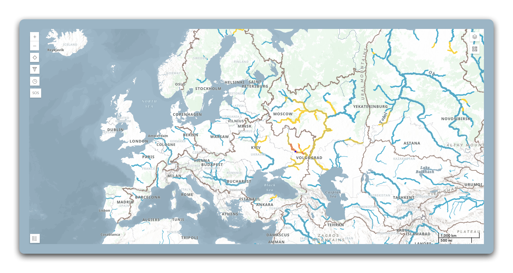
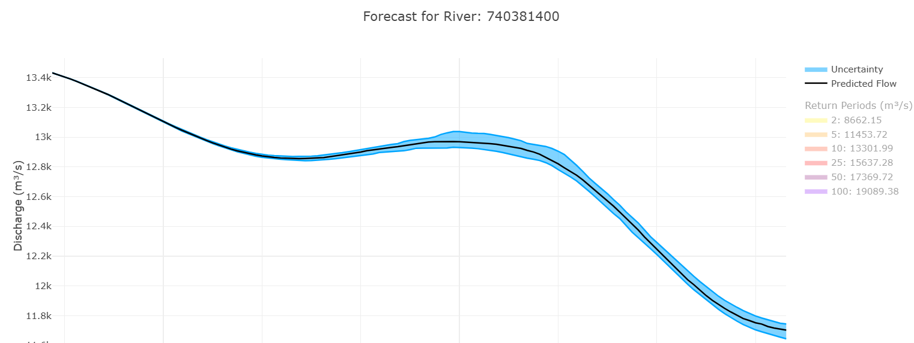

# Design Remake: Hydroviewer RFS v2

> Align the Hydroviewer with the GEOGLOWS portal visual system.
> Reference: `apps.geoglows/DESIGN.md` ("The Field Station")

## Current State

**Tech stack:** Vanilla JS, Vite 6, Plotly.js, Materialize CSS overrides, `@aquaveo/geoglows-auth`

**Current appearance:** The app uses Materialize CSS with default styling. The map is full-screen with a dark frame/border. Charts (forecast, retrospective, cumulative volume, peak discharge) render in Plotly.js with default Plotly theming (white background, gray gridlines, default font). The sidebar uses Materialize's default component styles. No visual connection to the portal.

**What needs to change:** Typography, color palette, chart theming, sidebar/panel styling, header treatment, and overall visual polish to match the portal's Field Station aesthetic.

---

## Design System Adoption

### Typography

| Element | Current | Proposed |
|---------|---------|----------|
| Chart titles | Plotly default (Open Sans) | Playfair Display, 400 weight |
| Axis labels | Plotly default | Inter, 0.75rem |
| Sidebar headings | Materialize default | Playfair Display, 400, text-xl |
| Body text / labels | Materialize default | Inter, 0.875rem |
| Button text | Materialize default | Inter, 600, 0.875rem |

**Font loading:** Add `Playfair Display` and `Inter` via Google Fonts, same import as the portal.

```html
<link href="https://fonts.googleapis.com/css2?family=Playfair+Display:wght@400;500;600;700&family=Inter:wght@300;400;500;600;700;800&display=swap" rel="stylesheet" />
```

### Color Palette

Adopt the portal's Workbench Palette directly:

| Role | Value | Usage |
|------|-------|-------|
| Primary | `#2563eb` | Active selection, buttons, links, focus rings |
| Primary hover | `#1d4ed8` | Button hover |
| Canvas | `#f8fafc` / `#0f172a` | App background (light / dark) |
| Surface | `#ffffff` / `rgba(255,255,255,0.03)` | Panels, sidebars, chart backgrounds |
| Text primary | `#1e293b` / `#f1f5f9` | Headings, labels |
| Text secondary | `#475569` / `#94a3b8` | Descriptions |
| Text muted | `#94a3b8` / `#475569` | Axis labels, metadata |
| Border | `#e2e8f0` / `rgba(255,255,255,0.1)` | Panel edges, dividers |

**Remove Materialize color overrides.** Replace with the portal palette.

### Border Radius

| Element | Value |
|---------|-------|
| Panels / sidebars | `1rem` (rounded-2xl) |
| Buttons | `0.75rem` (rounded-xl) |
| Inputs / selects | `0.75rem` (rounded-xl) |
| Chips / pills | `9999px` (rounded-full) |

---

## Component Redesign

### Header / Navigation Bar

**Current:** Materialize navbar with default styling.

**Proposed:** Match the portal header pattern:
- GEOGLOWS droplet icon + "HYDROVIEWER" wordmark (Inter bold, uppercase, tracking-wider)
- "Back to portal" link (text-sm, text-blue-600)
- Auth action slot from `@aquaveo/geoglows-auth` (`renderAuthAction`)
- Theme toggle button
- `bg-white/80 dark:bg-slate-950/80` with `backdrop-blur-xl`
- Border-bottom separator
- Compact height: `py-3` (this is a tool, not a landing page)


*Current: dark full-screen map with no branded header*

### Map Container

**Current:** Full-screen map with dark borders from the iframe/container.

**Proposed:**
- Map fills the viewport below the header (no dark frame borders)
- Map controls (zoom, layers) use the portal's button styling (rounded-xl, bg-white/80, backdrop-blur)
- No border around the map; it bleeds to the edges
- Layer toggle panel uses glass-card styling with `bg-white dark:bg-slate-900` and `border border-slate-200`

### Sidebar / Analysis Panel

**Current:** Materialize side-panel with default form controls.

**Proposed:**
- Slide-out panel from the right, `max-w-md`
- `bg-white dark:bg-slate-900` surface color
- `border-l border-slate-200 dark:border-slate-800` separator
- Panel header: Playfair Display heading (e.g., "River Analysis") with a close button
- Form controls: Inter labels (text-xs, uppercase, tracking-wider), rounded-xl inputs matching the portal profile form
- Section dividers: `border-t border-slate-200 dark:border-slate-800`

### Chart Panels

**Current:** Plotly.js charts with default white background and default fonts.

**Proposed Plotly layout overrides:**

```javascript
const portalPlotlyLayout = {
  font: {
    family: "'Inter', sans-serif",
    size: 12,
    color: '#475569',
  },
  title: {
    font: {
      family: "'Playfair Display', Georgia, serif",
      size: 18,
      weight: 400,
      color: '#1e293b',
    },
  },
  paper_bgcolor: '#ffffff',
  plot_bgcolor: '#ffffff',
  xaxis: {
    gridcolor: '#f1f5f9',
    linecolor: '#e2e8f0',
    tickfont: { size: 11, color: '#94a3b8' },
  },
  yaxis: {
    gridcolor: '#f1f5f9',
    linecolor: '#e2e8f0',
    tickfont: { size: 11, color: '#94a3b8' },
  },
  margin: { t: 48, r: 24, b: 48, l: 56 },
};
```

**Dark mode variant:**

```javascript
const portalPlotlyLayoutDark = {
  ...portalPlotlyLayout,
  font: { ...portalPlotlyLayout.font, color: '#94a3b8' },
  title: {
    font: { ...portalPlotlyLayout.title.font, color: '#f1f5f9' },
  },
  paper_bgcolor: '#0f172a',
  plot_bgcolor: '#0f172a',
  xaxis: {
    gridcolor: '#1e293b',
    linecolor: '#334155',
    tickfont: { size: 11, color: '#64748b' },
  },
  yaxis: {
    gridcolor: '#1e293b',
    linecolor: '#334155',
    tickfont: { size: 11, color: '#64748b' },
  },
};
```

**Chart container:** Each chart sits in a glass-card panel with `rounded-2xl p-4 md:p-6`. Chart title uses Playfair Display.


*Current: Plotly default styling with white bg and default fonts*

### Time Range Selector

**Current:** Plotly default buttons ("1 Year", "5 Years", etc.) with default styling.

**Proposed:** Pill-style toggle group matching the portal tag design:
- `rounded-full` pills
- Active: `bg-blue-600 text-white`
- Inactive: `bg-slate-100 dark:bg-slate-800 text-slate-600`
- `min-h-[44px]` touch targets
- Inter semibold, text-sm

### Buttons

Match portal button system:
- **Primary:** `bg-blue-600 hover:bg-blue-700 text-white rounded-xl px-4 py-2 font-semibold min-h-[44px]`
- **Secondary:** `bg-white dark:bg-slate-900 border border-slate-300 text-slate-700 rounded-xl`
- **Focus:** `focus-visible:ring-2 focus-visible:ring-blue-500`

---

## Layout Changes

### Desktop (md+)

```
┌──────────────────────────────────────────────┐
│ 💧 HYDROVIEWER   Back to portal   [Auth] [☀] │  Header
├──────────────────────────────────────────────┤
│                                    ┌────────┐│
│                                    │ Layer  ││
│           MAP (full width)         │ Panel  ││
│                                    │        ││
│                                    └────────┘│
├──────────────────────────────────────────────┤
│ ┌─────────────────┐ ┌──────────────────────┐ │
│ │   Forecast       │ │  Retrospective       │ │  Charts
│ │   (glass-card)   │ │  (glass-card)        │ │
│ └─────────────────┘ └──────────────────────┘ │
└──────────────────────────────────────────────┘
```

### Mobile

```
┌──────────────────┐
│ 💧 HYDROVIEWER   │
│ [Auth] [☀]       │  Header (nav below logo)
├──────────────────┤
│                  │
│    MAP           │  Map (full width)
│                  │
├──────────────────┤
│ [Layers] [Info]  │  Floating action buttons
├──────────────────┤
│ Forecast         │
│ (glass-card)     │  Charts stacked
├──────────────────┤
│ Retrospective    │
│ (glass-card)     │
└──────────────────┘
```

---

## Migration Steps

1. **Replace Materialize CSS** with Tailwind CSS v4 (same setup as the portal: `@tailwindcss/vite` plugin)
2. **Add fonts** (Playfair Display + Inter via Google Fonts)
3. **Update `@aquaveo/geoglows-auth`** to 1.6.0 (Playfair Display modal title, dark theme compat)
4. **Restyle header** using the portal header pattern
5. **Restyle map controls** (layer toggles, zoom) with glass-card and rounded-xl patterns
6. **Apply Plotly layout overrides** to all chart instances
7. **Restyle sidebar** with portal panel conventions
8. **Add dark mode support** matching the portal's theme toggle
9. **Add focus-visible rings** to all interactive elements
10. **Test responsive** at mobile, tablet, and desktop breakpoints

## Reference Images

| View | Current | Portal equivalent |
|------|---------|-------------------|
| Map |  | Full-bleed map, branded header above |
| Forecast |  | Glass-card panel, Playfair title, Inter axes |
| Retrospective | *Same Plotly default* | Glass-card panel, matching chart theme |
