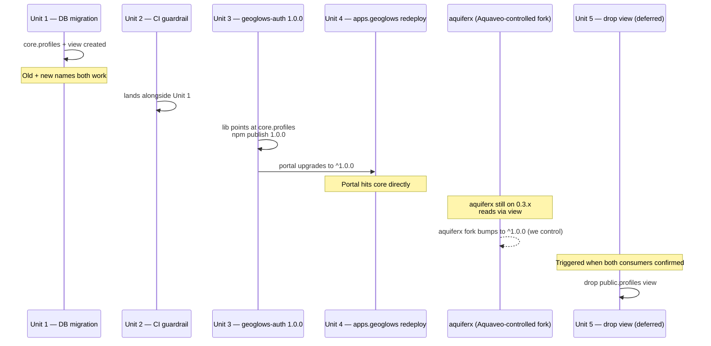

# feat: Relocate public.profiles to core schema

## Overview

Establish the `core` schema and relocate `public.profiles` into it as `core.profiles`, the canonical user-profile table for all GEOGloWS portal apps. Use a backwards-compatible `security_invoker` view to keep the old name working through the consumer cutover. Release a new `@aquaveo/geoglows-auth` (`1.0.0`) that reads/writes `core.profiles` directly. Add one CI guardrail in this repo to fail on any RLS-less table in `core` or `public`.

This plan is the first slice of the multi-app schema architecture (origin: `docs/plans/2026-04-29-004-feat-multi-app-schema-architecture-requirements.md`). Per-app schemas, per-repo migration roles, FK conventions, default-deny templates, and onboarding playbooks are intentionally **deferred** to first-actual-need under YAGNI.

## Problem Frame

The Supabase database currently has a single application table at `public.profiles`. As more apps come online, a flat `public` namespace will sprawl. The brainstorm settled on namespace-per-app inside one Supabase project, with a shared `core` schema for cross-app concerns. Relocating `profiles` is the only piece of work whose consumer exists today — every other piece of the topology is anticipatory and waits for an app to actually need it.

The relocation is non-trivial because four browser-side `.from('profiles')` call sites in `geoglows-auth` (lines 24, 27, 57, 100 of `core/account.ts` and `core/profile.ts`) are baked into every running tab of every consumer. A single rename breaks all of them simultaneously. The plan uses a two-step approach with an updatable `security_invoker` view to bridge the cutover.

## Requirements Trace

- **R1.** `core.profiles` exists and holds the canonical user profile (origin §3.4).
- **R2.** `public.profiles` continues to work as a read-write target through the cutover via a view (origin §3.5).
- **R3.** RLS on `core.profiles` is evaluated in the calling user's context — both directly and through the view (origin §3.5, §7).
- **R4.** A new `@aquaveo/geoglows-auth` version reads/writes `core.profiles` (origin §3.5 step 2; resolved during planning as hardcoded `core.profiles`, no schema parameter).
- **R5.** `apps.geoglows` runs against the new lib version with no functional regression (origin §3.5 step 2, §7).
- **R6.** CI in this repo fails any migration that adds a table to `core` or `public` without `relrowsecurity = true` (origin §3.3, §7).
- **R7.** The `public.profiles` view is dropped in a follow-up migration after both consumers (apps.geoglows + the controlled aquiferx fork) have shipped against `geoglows-auth 1.0.0` in production (origin §3.5 step 3).

## Scope Boundaries

- Per-app schemas (`aquiferx`, `rfs_v2`, `grace_groundwater`) are NOT created.
- Per-repo Postgres migration roles are NOT provisioned (continue using the project DB password for `supabase db push`).
- Default-deny migration template, policy-shape CI lint, FK convention, Hard-isolation checklist, per-app onboarding playbook are NOT written.
- Other `core` tables (`organizations`, `memberships`, `roles`, `app_registry`, `app_access`, `app_usage`, `audit_log`) are NOT created.
- The upstream `njones61/aquiferx` repo is NOT modified by this plan. Coordination there is courtesy notification, not blocking.

### Deferred to Separate Tasks

- **Drop `public.profiles` view (R7):** its own follow-up PR, triggered when both `apps.geoglows` AND the Aquaveo-controlled aquiferx fork have shipped builds against `geoglows-auth 1.0.0` in production. Since we control both deploys, this should land within days/weeks of Unit 4, not months.

## Context & Research

### Relevant Code and Patterns

- `supabase/migrations/20260323214658_auth.sql` — original `public.profiles` table definition (id, email, display_name, created_at).
- `supabase/migrations/20260323214730_rls.sql` — current RLS policies on `public.profiles` (`profiles_select_own`, `profiles_insert_own`, `profiles_update_own`). All predicate on `(select auth.uid())`; port cleanly.
- `supabase/migrations/20260429021219_rich_user_profiles.sql` — most recent table extension. Adds `first_name`, `middle_name`, `last_name`, `phone_number`, `user_type`, `address`, `user_link`, `avatar_url` columns; adds `profiles_user_link_format` CHECK constraint; creates `public.user_type` enum. The `core.profiles` table needs the full final shape.
- `supabase/config.toml` — `major_version = 17` (Postgres 17). `WITH (security_invoker = true)` was added in PG 15, so the project supports it.
- `../geoglows-auth/src/core/profile.ts` — `ensureProfile()` (select-then-insert at lines 27, 57), `updateProfile()` (update at line 100). Three of the four `.from('profiles')` call sites live here.
- `../geoglows-auth/src/core/account.ts` — `loadAccountSummary()` reads `.from('profiles')` at line 24.
- `../geoglows-auth/CLAUDE.md` — lib has dual surfaces (`core` for vanilla, `react` for React) and is published to npm under `@aquaveo/geoglows-auth`. The `Profile` interface in `src/types.ts` is the source of truth for the table shape.
- `docs/plans/2026-04-28-001-chore-upgrade-geoglows-auth-0.2.0-plan.md` — prior precedent for sequencing a `geoglows-auth` version bump through this repo.

### Institutional Learnings

- `../geoglows-auth/docs/solutions/logic-errors/ensureprofile-upsert-overwrites-user-edits-2026-04-29.md` — `ensureProfile` is select-then-insert by design (NOT upsert). Switching to `core.profiles` must preserve that semantics.
- `../geoglows-auth/docs/solutions/best-practices/user-metadata-is-auth-identity-not-profile-of-record-2026-04-29.md` — `user_metadata` only seeds new rows; never re-flows on subsequent sign-ins.

### External References

- Postgres `WITH (security_invoker = true)` view option (added in PG 15). Required so RLS on the underlying table is evaluated in the calling user's context rather than the view owner's. Without it, RLS is effectively bypassed for views — a load-bearing detail for this plan.

## Key Technical Decisions

- **Two-step relocation, not single rename.** Four hardcoded `.from('profiles')` call sites in geoglows-auth would 404 the moment `public.profiles` is renamed. A `security_invoker` view bridges old-bundle consumers through the cutover.
- **`security_invoker = true` on the view.** Postgres views default to owner-context RLS evaluation, which would silently bypass `core.profiles`'s `auth.uid()` row-predicates. `security_invoker = true` causes RLS on the underlying table to evaluate in the calling user's context — the only correct behavior here.
- **Explicit grants on `core.profiles` to `authenticated`.** View traversal still requires the calling role to have `USAGE` on `core` and SELECT/INSERT/UPDATE on `core.profiles`. Without these, queries through the view return "permission denied for table profiles" even with the view in place.
- **`geoglows-auth` hardcodes `core.profiles` (not parameterized).** The lib is the natural single source of truth for profile shape (per its CLAUDE.md). A schema parameter is speculative future-proofing for multi-tenant scenarios that don't exist.
- **`core` is added to PostgREST's exposed-schemas list.** `supabase.schema('core').from(...)` sends `Accept-Profile: core`; PostgREST 406s with PGRST106 if `core` is not exposed, regardless of GRANTs. Unit 1 updates `[api].schemas` in `supabase/config.toml`; the production project's Dashboard → API → Exposed schemas setting is updated as part of the production rollout (see Operational Notes). The view in `public` keeps the old name working through the cutover.
- **Project DB password for `supabase db push`.** Per-repo migration roles deferred per origin §3.2.
- **CI guardrail covers `core` AND `public`** in this repo — so the view's underlying table is also protected.
- **`user_type` enum moves to `core.user_type`.** Single `alter type public.user_type set schema core;` statement. Postgres tracks types by OID so column references update automatically. Keeps `public` clean of application objects after Unit 5 — consistent with the schema-relocation goal. The `UserType` TypeScript enum in `geoglows-auth/src/types.ts` is independent (string-literal-based) and doesn't need to change.
- **Major version bump** for `geoglows-auth` (`1.0.0`). The TypeScript surface (`Profile` type, public function signatures) doesn't change, but the lib's runtime DB contract does (sends `Accept-Profile: core`; depends on `core.profiles` existing). Both production consumers (apps.geoglows + the controlled aquiferx fork) are under our control, so silent caret-range uptake isn't a coordination risk in practice — but the lib is published to public npm and a major bump is the honest semver signal for a runtime-contract change.

## Open Questions

### Resolved During Planning

- **PostgREST schema exposure (origin OQ #1):** `core` must be added to the exposed-schemas list. Both `supabase/config.toml` (`[api].schemas`) and the production project's Dashboard → API → Exposed schemas setting are updated. The view in `public` ensures the old name still works for older bundles. The `Accept-Profile: core` header sent by `.schema('core')` requires `core` to be in PostgREST's allowlist; grants alone are not sufficient.
- **`geoglows-auth` API shape:** hardcoded `core.profiles`. No schema parameter on the public surface.
- **Release version strategy:** major bump (`1.0.0`). Honest semver signal that the runtime DB contract changed. Both production consumers are under our control so cutover timing is a non-issue.
- **`njones61` notification timing (origin OQ #4):** courtesy-notify after `1.0.0` is published as an FYI to the upstream maintainer; not on the critical path. The deployed aquiferx is from a controlled fork (see Cross-repo dependencies in Risks/Notes), so we control the cutover timeline.
- **Production rollout ordering:** Dashboard exposes `core` → migration applies in production → npm publish `1.0.0` → apps.geoglows redeploy. Reversing any pair causes immediate breakage. See Operational Notes.

### Deferred to Implementation

- **Pre-migration `pg_depend` results.** Sweep when writing Unit 1 to verify no surprise dependencies (stray triggers on `auth.users`, FKs from another schema, materialized views).
- **Cutover signal for Unit 5.** Both `apps.geoglows` and the controlled aquiferx fork have shipped builds against `geoglows-auth 1.0.0` in production. Since we control both, the trigger is concrete and near-term: 7-day soak window after the second deploy ships, then drop the view.

## High-Level Technical Design

> *This illustrates the intended approach and is directional guidance for review, not implementation specification. The implementing agent should treat it as context, not code to reproduce.*

**Migration shape (Unit 1):**

```sql
-- 1. New home
create schema if not exists core;
grant usage on schema core to authenticated;

-- 1b. Move the user_type enum into core (column references follow via OID)
alter type public.user_type set schema core;

-- 2. Table (full column list copied from public.profiles, including
--    user_type enum reference to public.user_type and the user_link CHECK)
create table core.profiles ( ... );

-- 3. Data
insert into core.profiles select * from public.profiles;

-- 4. Grants on the new table
grant select, insert, update on core.profiles to authenticated;

-- 5. RLS — drop on public to free policy names, recreate on core
drop policy "profiles_select_own" on public.profiles;
drop policy "profiles_insert_own" on public.profiles;
drop policy "profiles_update_own" on public.profiles;
alter table core.profiles enable row level security;
create policy "profiles_select_own" on core.profiles for select to authenticated
  using ((select auth.uid()) is not null and id = (select auth.uid()));
-- ... insert / update policies similarly ...

-- 6. Replace table with security_invoker view
drop table public.profiles;  -- no CASCADE; we want loud failure if something pins it
create view public.profiles
  with (security_invoker = true)
  as select * from core.profiles;
grant select, insert, update on public.profiles to authenticated;
```

**Cutover sequence:**



## Implementation Units

- [ ] **Unit 1: DB migration — create core.profiles + security_invoker view**

**Goal:** Relocate `public.profiles` to `core.profiles` while keeping `public.profiles` accessible via an RLS-correct view.

**Requirements:** R1, R2, R3.

**Dependencies:** None. Lands first.

**Files:**
- Create: `supabase/migrations/<timestamp>_relocate_profiles_to_core.sql`
- Modify: `supabase/config.toml` — add `core` to `[api].schemas` (currently `["public", "graphql_public"]` → `["public", "graphql_public", "core"]`).
- Test: `tests/migrations/profiles-relocation.test.sql` (new — pure SQL runbook executed via `psql -f` against a local Supabase stack with the migration applied; see Test scenarios)

**Approach:**
- **Pre-migration inventory step (BLOCKING — runs before authoring migration).** Run `pg_depend` and `pg_trigger` queries against the prod project (or a recent snapshot) to enumerate every object that references `public.profiles`:
  ```sql
  select pg_describe_object(classid, objid, objsubid) from pg_depend where refobjid = 'public.profiles'::regclass;
  select tgname, tgrelid::regclass from pg_trigger where tgrelid = 'auth.users'::regclass;
  ```
  Also `\dp public.profiles` to capture the current full grant list (per role, not just `authenticated`).
  Also `grep -rn "from('profiles')\|from(\"profiles\")" ../aquiferx/src ../aquiferx/services 2>/dev/null` to detect any direct call sites in aquiferx outside `geoglows-auth` (the view bridges them but we should know they exist).
  Document findings as a comment block at the top of the migration. If `pg_depend` reveals a `handle_new_user` trigger or any other unexpected dependent, the migration scope expands to handle it (e.g., update the trigger function to target `core.profiles`).
- **Single-transaction execution.** Supabase CLI wraps each migration file in a transaction by default. The migration relies on this for atomicity — do NOT split this migration into multiple files. Add a `BEGIN;` / `COMMIT;` at the top/bottom belt-and-braces is acceptable but the wrap is already implicit.
- **Lock the source table at migration start.** First statement after `BEGIN;`: `LOCK TABLE public.profiles IN ACCESS EXCLUSIVE MODE;`. Prevents concurrent writes from landing in `public.profiles` between the data copy and the table drop — closes the race where a row inserted mid-migration would be silently lost. Lock is held until COMMIT (milliseconds).
- **Order of operations:** see High-Level Technical Design above. Critical points:
  - The pre-drop of policies on `public.profiles` is COSMETIC ONLY — Postgres auto-drops policies when their table is dropped. Keeping the explicit drops makes the migration easier to read and frees the policy names so they can be re-used on `core.profiles` (policy names are scoped per-table, so this is also strictly speaking unnecessary, but consistent).
  - Drop the table WITHOUT CASCADE so any unexpected dependent object (FK from another schema, view, materialized view, trigger function) surfaces as a loud migration failure rather than silent data loss.
  - **Underlying-table grants on `core.profiles` are required** for PostgREST to authorize traffic through the view (with `security_invoker = true`, the calling user's grants on the underlying table are what matter). View-level grants on `public.profiles` are also added — view-level grants are required for PostgREST to expose the view as a REST endpoint.
- **Migration file comment requirement.** Above the `create view public.profiles ...` statement, include a prominent comment: `-- WARNING: WITH (security_invoker = true) is LOAD-BEARING. Removing or omitting it bypasses RLS on core.profiles and exposes all user PII to any authenticated user. Do not remove this flag in any future CREATE OR REPLACE VIEW.` This survives copy-paste edits.
- **Constraints that travel:** `user_type` enum (`alter type public.user_type set schema core;` — moves the enum atomically; existing column references continue to resolve because Postgres uses OIDs); `profiles_user_link_format` CHECK constraint; PRIMARY KEY on `id`; `email` `NOT NULL`; `created_at` default `now()`; any other defaults / NOT NULL on the existing columns. The directional sketch in High-Level Technical Design is intentionally minimal — copy the exact column list from `\d public.profiles` rather than from the sketch.

**Patterns to follow:**
- `supabase/migrations/20260429021219_rich_user_profiles.sql` — section-comment formatting for multi-step migrations.
- `supabase/migrations/20260323214730_rls.sql` — RLS policy formatting (`(select auth.uid())` idiom; `to authenticated` clause).

**Test scenarios:**
- *Happy path:* After migration, `select * from core.profiles` returns the same rows as `select * from public.profiles` returned pre-migration (data preserved; row count identical).
- *Happy path:* Authenticated user with `auth.uid() = X` querying `select * from public.profiles` (through view) returns exactly that user's row.
- *Happy path:* Same user can `update public.profiles set display_name = 'new'` through the view; change reflected in `core.profiles`.
- *Happy path:* Same user can `insert into public.profiles` through the view; row appears in `core.profiles`.
- *Edge case:* User attempting to read another user's row via `select ... where id = '<other>'` (through view) returns 0 rows — RLS USING enforced through `security_invoker`.
- *Edge case:* User attempting `insert into public.profiles (id, ...) values ('<other>', ...)` is rejected — RLS WITH CHECK enforced through view.
- *Edge case:* Same checks against `core.profiles` directly (not via view) — RLS still enforced.
- *Error path:* Required negative test on a deliberately-broken local view (`security_invoker = false`) — confirms it would bypass RLS, validating the flag is load-bearing. Pairs with the migration-file warning comment to keep future readers from removing the flag.

**Verification:**
- Migration applies cleanly on a fresh local Supabase stack (`supabase db reset`).
- Migration applies cleanly on a stage/preview project mirroring prod schema.
- All test scenarios pass.
- Pre-migration inventory comment in the migration file lists actual `pg_depend` results (not a placeholder).
- **Manual cross-layer verification (one-time, captured in PR description):** with the migration applied to a local Supabase stack, run `apps.geoglows` locally pinned to `@aquaveo/geoglows-auth@0.3.1` (the older version that hits `from('profiles')` without a schema). Sign in, load the profile page, edit `display_name`, save, hard-refresh, confirm persisted. This proves the `security_invoker` view works end-to-end for older bundles — the central correctness claim of §3.5. Behavior is transient (disappears at Unit 5) so it's a manual smoke step, not a permanent test harness.

---

- [ ] **Unit 2: CI guardrail — RLS-enabled check on core + public**

**Goal:** Fail CI if any table in `core` or `public` lacks `relrowsecurity = true`.

**Requirements:** R6.

**Dependencies:** Unit 1 (the schema must exist for the check to verify it).

**Files:**
- Create: `.github/workflows/db-rls-check.yml` (this repo currently has no `.github/workflows/` — Unit 2 establishes the convention).
- Create: `scripts/check-rls-enabled.sql` — the SQL the workflow runs.
- Test: `tests/scripts/check-rls-enabled.test.sql` (new) — pure SQL fixture-based verification, runs via `psql -f`.

**Approach:**
- **The SQL check:** select tables in `core` and `public` schemas where `relrowsecurity = false` and `relkind = 'r'` (regular table). Views (`relkind = 'v'`) are excluded. If any rows return, fail with their names listed.
- **CI invocation:** workflow starts a local Supabase stack (`supabase start`), pushes migrations (`supabase db push --local`), runs the check via `psql -v ON_ERROR_STOP=1 -f scripts/check-rls-enabled.sql`. Avoids needing prod credentials in CI.
- **Trigger:** workflow runs on every PR touching `supabase/migrations/**`.
- **Failure mode:** non-zero exit code; offending table names in stderr.
- **Scope:** the check only enforces RLS-enabled, not RLS-correct. Policy-shape lint is explicit non-goal per origin §3.3.

**Patterns to follow:**
- Test approach (run against local stack, not prod): consistent with existing test pattern that stubs `import.meta.env.VITE_*` (`tests/setup.js`) — no live-prod paths in test code.
- Workflow file format: standard GitHub Actions YAML; this is the first workflow in this repo, so no in-repo precedent.

**Test scenarios:**
- *Happy path:* Run check against current schema (after Unit 1 lands) — exits 0.
- *Error path:* Run check against a tampered fixture (a temporary local migration that adds `core.test_no_rls` without `enable row level security`) — exits non-zero; stderr names `core.test_no_rls`.
- *Edge case:* Tables in schemas other than `core`/`public` (e.g., `auth.users`) are NOT flagged — exit 0.
- *Edge case:* The `public.profiles` VIEW is NOT flagged — `relkind = 'v'` filter excludes it.
- *Integration:* The workflow runs on a PR touching `supabase/migrations/**` (verified by an empty no-op migration PR).

**Verification:**
- `actionlint` (or equivalent) passes on the workflow file.
- A deliberately-broken fixture migration causes the workflow to fail in CI (manual verification on a throwaway PR).
- A clean PR adding an RLS-enabled table to `core` passes.

---

- [ ] **Unit 3: New geoglows-auth release reading core.profiles**

**Goal:** Update the lib's four `.from('profiles')` call sites to use `.schema('core').from('profiles')`. Bump version to `1.0.0`. Publish to npm.

**Requirements:** R4.

**Dependencies:** Unit 1 must be **applied to the production Supabase project** before this unit's `npm publish` (not just merged in this repo). Reason: `apps.geoglows`'s Vercel previews share the production Supabase project — any preview build picking up `1.0.0` via caret-range will hit production PostgREST and 406 if `core` is not exposed and `core.profiles` does not exist. Sequence: Unit 1 PR merged → Dashboard exposes `core` → `supabase db push` to production → THEN `npm publish 1.0.0`. See Operational Notes for the full rollout sequence.

**Files:**
- Modify: `../geoglows-auth/src/core/profile.ts` (3 call sites at lines 27, 57, 100)
- Modify: `../geoglows-auth/src/core/account.ts` (1 call site at line 24)
- Modify: `../geoglows-auth/package.json` — version `0.3.x` → `1.0.0`
- Modify: `../geoglows-auth/CHANGELOG.md` (or equivalent) — note the schema relocation; flag that older consumers continue to work via the `public.profiles` view but should upgrade to use `core` directly
- Modify: `../geoglows-auth/tests/core/profile.test.ts` — mock setup expects `.schema('core').from('profiles')` chain
- Modify: `../geoglows-auth/tests/core/account.test.ts` — same

**Approach:**
- Replace each `supabase.from('profiles')` with `supabase.schema('core').from('profiles')` in the four lib call sites.
- The `Profile` TypeScript interface (`src/types.ts`) does NOT change — column shape is identical, just relocated. This keeps the consumer-facing API stable.
- Tests assert observable behavior per `../geoglows-auth/CLAUDE.md` conventions: mock sets up state, lib function runs, assertions check resulting state. Mocks now intercept `.schema('core').from('profiles')` instead of `.from('profiles')`.
- Publish: requires Aquaveo org membership + 2FA OTP per `../geoglows-auth/CLAUDE.md`.

**Patterns to follow:**
- `docs/plans/2026-04-28-001-chore-upgrade-geoglows-auth-0.2.0-plan.md` — sequencing for build / publish / tag / consumer-update.
- `../geoglows-auth/CLAUDE.md` § Publishing — checklist for the npm publish path.

**Test scenarios:**
- *Happy path:* `ensureProfile()` against a mock returning an existing row (in `core.profiles`) returns it unchanged — preserves select-then-insert semantics from the regression test introduced in 0.3.1.
- *Happy path:* `ensureProfile()` against a mock with no existing row inserts to `core.profiles`; returns the new row.
- *Happy path:* `updateProfile()` against a mock updates `core.profiles`; returns updated row.
- *Happy path:* `loadAccountSummary()` against a mock returns the profile from `core.profiles`.
- *Error path:* `ensureProfile()` propagates a select error from supabase-js correctly.
- *Error path:* `ensureProfile()` propagates an insert error (e.g., RLS violation) correctly.
- *Integration:* The full vitest+jsdom suite passes after the call-site updates.

**Verification:**
- `npm test` in `../geoglows-auth/` passes.
- `npm run build` produces ESM + CJS bundles with the updated call shape.
- `npm run lint` clean.
- Published version `1.0.0` resolves on `npm view @aquaveo/geoglows-auth versions`.
- Git tag `v1.0.0` pushed.

---

- [ ] **Unit 4: apps.geoglows consumer cutover to geoglows-auth 1.0.0**

**Goal:** Bump this repo's `@aquaveo/geoglows-auth` dependency to `^1.0.0`. Smoke-test the auth + profile flow end-to-end.

**Requirements:** R5.

**Dependencies:** Unit 3 (lib must be on npm).

**Files:**
- Modify: `package.json` — bump `@aquaveo/geoglows-auth` to `^1.0.0`
- Modify: `package-lock.json` (regenerated via `npm install`)
- No source changes expected — this repo uses the lib's `core` surface (`bootstrapSession`, `loadAccountSummary`, `updateProfile`); none of those changed signatures.

**Approach:**
- Profile type and lib API surface didn't change. Only the lib's internals point at a different schema. Consumer code is untouched.
- After upgrade: full vitest suite + manual smoke test on the PR's Vercel preview deploy.

**Patterns to follow:**
- `docs/plans/2026-04-28-001-chore-upgrade-geoglows-auth-0.2.0-plan.md` § smoke checklist — same shape applies here.

**Test scenarios:**
- *Happy path:* Sign in flow on Vercel preview: navbar shows user avatar/name; profile page loads with current data.
- *Happy path:* Edit profile (e.g., `display_name`), save, hard-refresh; data persisted.
- *Happy path:* Sign out, sign in again; profile loads correctly.
- *Edge case:* New user sign-up: `ensureProfile` creates a new `core.profiles` row.
- *Integration:* Existing vitest suite (`tests/`) passes against the new lib.
- *Integration:* Browser DevTools network tab confirms requests now hit `core.profiles` — look for the `Accept-Profile: core` header on `/rest/v1/profiles` calls (added by `.schema('core')`).

**Verification:**
- `npm test` passes.
- Manual smoke test on the PR's Vercel preview: golden path works.
- After production deploy: aquiferx (still on `0.3.x`) continues to work in parallel via the view (until Unit 4b ships).

---

- [ ] **Unit 4b: aquiferx fork cutover to geoglows-auth 1.0.0**

**Goal:** Bump the Aquaveo-controlled aquiferx fork's `@aquaveo/geoglows-auth` dependency to `^1.0.0`. Deploy the updated fork. Verify aquiferx now hits `core.profiles` directly instead of via the view.

**Requirements:** R5 (extended to include the controlled aquiferx fork).

**Dependencies:** Unit 3 (lib on npm). Can land in parallel with Unit 4 or shortly after.

**Files:**
- Modify (in the controlled aquiferx fork, not in this repo): `package.json` — bump `@aquaveo/geoglows-auth` to `^1.0.0`
- Modify (fork): `package-lock.json` (regenerated)
- No source changes expected in the fork — aquiferx uses the lib's `react` surface (`<AuthProvider>`, `useAuth`, `<SupabaseAuthUI>`); none of those changed signatures.

**Approach:**
- Mirror Unit 4's approach: bump dependency, run aquiferx's existing test suite, smoke-test on a Vercel preview, deploy to production.
- Goal is to retire the view bridge for aquiferx as soon as practical — the controlled fork lets us schedule this immediately rather than waiting on upstream.
- Optional: cherry-pick or PR the dep bump back to `njones61/aquiferx` upstream as a courtesy. Not required for v1.

**Patterns to follow:**
- Same as Unit 4 — version-bump pattern.

**Test scenarios:**
- *Happy path:* aquiferx Vercel preview: sign in via the cross-app shared session, profile loads correctly through `core.profiles`.
- *Happy path:* Edit profile from aquiferx (if its UI supports profile edit), save, refresh, persisted.
- *Integration:* aquiferx's existing test suite passes against the new lib.
- *Integration:* Browser DevTools confirms `Accept-Profile: core` header on `/rest/v1/profiles` calls from aquiferx.

**Verification:**
- aquiferx fork's tests pass.
- Manual smoke test on aquiferx Vercel preview: golden path works.
- Production deploy of the fork: confirmed running on `1.0.0`.

---

- [ ] **Unit 5: Drop public.profiles view (follow-up after both deploys)**

**Goal:** Remove the `public.profiles` view once both consumers (apps.geoglows + controlled aquiferx fork) are on `geoglows-auth 1.0.0` in production.

**Requirements:** R7.

**Dependencies:** Unit 4 (apps.geoglows on 1.0.0 in prod) AND Unit 4b (aquiferx fork on 1.0.0 in prod).

**Files:**
- Create: `supabase/migrations/<timestamp>_drop_public_profiles_view.sql`

**Approach:**
- After both production deploys ship, wait ~7 days for stale browser tabs and cached Vercel previews to age out.
- The migration is one statement: `drop view public.profiles;` plus the implicit revocation of view-level grants. No data loss (data lives in `core.profiles`).
- **Lands in a separate PR** ~1-2 weeks after Unit 4b. Since we control both consumers, the trigger is concrete and near-term — not the multi-month deferred state earlier reviewers were worried about.

**Patterns to follow:**
- Migration formatting: same as Unit 1.

**Test scenarios:**
- *Happy path:* After dropping the view, `apps.geoglows` (on 1.0.0) continues to work — talks directly to `core.profiles`.
- *Happy path:* aquiferx (on 1.0.0) continues to work.
- *Error path:* If a stale browser tab somehow still uses `from('profiles')` (without `.schema('core')`), it gets "relation does not exist". The 7-day soak window mitigates this. Documented rollback: `create view public.profiles with (security_invoker = true) as select * from core.profiles; grant select, insert, update on public.profiles to authenticated;` — re-creates the view in seconds.

**Verification:**
- Both production deploys confirmed on 1.0.0 in PR description before merge.
- Soak window observed.
- Production smoke test: both apps functional after the drop.

## System-Wide Impact

- **Interaction graph:** all browser-side profile reads/writes flow through `geoglows-auth`. The lib's call sites change once (Unit 3); this repo's source is unchanged.
- **Error propagation:** `ensureProfile` and `updateProfile` propagate Supabase errors as-is; behavior unchanged. New error class to be aware of: "permission denied for table profiles" if Unit 1 step 4's underlying-table grants are accidentally omitted — Unit 1 tests cover this.
- **State lifecycle risks:** mid-migration, a row inserted into `public.profiles` via the view lands in `core.profiles` — no risk of split state. Pre-migration data is preserved (Unit 1 step 3 copies it).
- **API surface parity:** `Profile` TypeScript type is unchanged. PostgREST request shape *does* change for 1.0.0 clients (they send `Accept-Profile: core` header via `.schema('core')`). The view bridges this for older clients.
- **Integration coverage:** Unit 1's integration test (`ensureProfile` / `updateProfile` against the migrated DB using the OLD lib version) is the critical cross-layer test that the view actually works end-to-end. Mocks alone won't prove this.
- **Unchanged invariants:** `Profile` shape, `ensureProfile` semantics (select-then-insert), `display_name` composition rules, `user_metadata` non-flow rule — all preserved.

## Risks & Dependencies

| Risk | Mitigation |
|------|------------|
| `security_invoker = true` flag omitted/typo'd → silent RLS bypass through view | Unit 1 test scenarios include explicit "without `security_invoker`" negative test; Unit 1 verification requires test-suite green before merge. |
| Underlying-table grants forgotten → "permission denied" error post-migration | Unit 1 Approach calls them out explicitly; Unit 1 tests exercise authenticated SELECT/INSERT/UPDATE through the view. |
| `pg_depend` inventory misses an object pinning `public.profiles` (e.g., a stray `auth.users` trigger) | Unit 1 Approach mandates the inventory step; `drop table public.profiles` without CASCADE fails loudly if any object still depends on it, surfacing the issue at migration time. |
| `geoglows-auth 1.0.0` regresses the `Profile` type or call shape | Unit 3 explicit constraint that `Profile` doesn't change; existing vitest suite + new schema-aware mocks catch regressions before publish. |
| Forgot to recreate the view alongside a `core.profiles` column change while the view exists | Window is bounded (~1-2 weeks between Unit 4b deploy and Unit 5 view drop). For additive nullable columns, view recreate isn't required. For breaking changes, schedule them after Unit 5. Add a one-line note to `apps.geoglows/CLAUDE.md` reminding reviewers of this rule until the view is dropped. |
| Production migration timing — `drop table public.profiles` requires a brief exclusive lock | Unit 1 acquires `LOCK TABLE public.profiles IN ACCESS EXCLUSIVE MODE` at the start of the migration transaction; concurrent writes wait. Apply during low-traffic hours regardless. Lock window measured in milliseconds. |
| First `.github/workflows/` in this repo (Unit 2) — no in-repo precedent for workflow conventions | Unit 2 establishes the convention. Future workflows mirror its shape. |
| Concurrent write to `public.profiles` lands between data copy and table drop | LOCK TABLE at migration start (above) closes this window — concurrent writes block until COMMIT. |
| Vercel preview shares production Supabase project; consumer auto-pulls `1.0.0` before production migration is applied | Production rollout sequence (Operational Notes) requires Dashboard exposure + prod migration BEFORE `npm publish`. Unit 3 Dependencies make this explicit. Major bump to `1.0.0` means caret-range consumers stay on `0.3.x` until they explicitly bump — eliminating the silent-uptake path even outside our two controlled consumers. |
| Lib's runtime DB contract changes; consumers might silently auto-upgrade and break | Major bump to `1.0.0` (Key Technical Decisions) — forces deliberate consumer upgrade. Caret-range consumers stay on `0.3.x` until they explicitly bump. |
| ~~View becomes permanent~~ | Resolved by Unit 4b — we control the aquiferx fork's `1.0.0` cutover, so Unit 5 has a concrete near-term trigger rather than depending on upstream. |

## Documentation / Operational Notes

### Production rollout sequence (DO IN THIS ORDER)

Vercel previews of `apps.geoglows` and `aquiferx` share the production Supabase project (no separate staging Supabase). This means consumer-side changes hit production-side schema as soon as they deploy. The sequence below is mandatory; reversing any pair causes immediate breakage.

1. **Supabase Dashboard → Project Settings → API → Exposed schemas:** add `core` to the list. Save. Effective immediately on the live project. (Idempotent; no harm if `core` does not yet exist.)
2. **Apply Unit 1 migration to production:** `supabase db push` from `apps.geoglows` against the project. Verify in SQL editor that `core.profiles` exists, has data, has RLS enabled, has policies, has grants; verify `public.profiles` view exists with `security_invoker = true`.
3. **Smoke test against production from a temporary local checkout** still on `geoglows-auth@0.3.x`: confirm reads/writes through the view work for an authenticated test user. (Aquiferx's older bundles must keep working — this is the test for that.)
4. **Publish `geoglows-auth@1.0.0`** to npm.
5. **Bump `apps.geoglows` to `^1.0.0` and deploy** (Unit 4 PR merge + production deploy).
6. **Smoke test against production** from `apps.geoglows` 1.0.0: confirm `.schema('core')` traffic returns the expected `Accept-Profile: core` header on profile calls and the page works.

### Documentation updates

- After Unit 1 lands: update `apps.geoglows/CLAUDE.md` to reflect `core.profiles` as the canonical table location (currently references `profiles` without schema qualification). Add this as a checkbox under Unit 1 verification.
- After Unit 3 ships: update `../geoglows-auth/CLAUDE.md` to note the schema location.
- After Unit 2 lands: optionally add a one-paragraph note to `README.md` about the RLS CI guardrail (post-merge follow-up; not in Unit 2 scope).

### Rollback

- **Unit 1 rollback:** forward-only per Supabase convention. Recovery is a new forward migration that drops the view, recreates `public.profiles` from `core.profiles`, drops `core.profiles`. Unit 1's tests should catch problems before this is needed.
- **Unit 5 rollback:** re-create the view via `create view public.profiles with (security_invoker = true) as select * from core.profiles; grant select, insert, update on public.profiles to authenticated;`. Seconds.
- **Sequencing failure (npm published before prod migration):** consumers on caret-ranges who pulled `1.0.0` will see PGRST106 errors. Fast recovery: deploy/apply the prod migration ASAP. Slower recovery: publish `0.4.1` that reverts to `from('profiles')` (do not delete `1.0.0` from npm — too late, consumers may already have it).

## Sources & References

- **Origin document:** `docs/plans/2026-04-29-004-feat-multi-app-schema-architecture-requirements.md`
- Related code:
  - `supabase/migrations/20260323214658_auth.sql`
  - `supabase/migrations/20260323214730_rls.sql`
  - `supabase/migrations/20260429021219_rich_user_profiles.sql`
  - `supabase/config.toml`
  - `../geoglows-auth/src/core/profile.ts`
  - `../geoglows-auth/src/core/account.ts`
  - `../geoglows-auth/src/types.ts`
- Related plans: `docs/plans/2026-04-28-001-chore-upgrade-geoglows-auth-0.2.0-plan.md` (prior `geoglows-auth` upgrade pattern)
- External: Postgres `WITH (security_invoker = true)` view option (PG 15+; project on PG 17 per `supabase/config.toml`).
