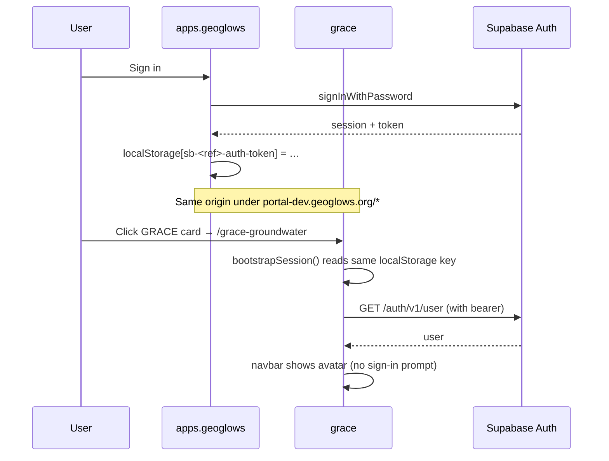

# feat: Add grace-groundwater-dashboard to the GEOGloWS portal

## Overview

Integrate the existing `grace-groundwater-dashboard` Vite app into the GEOGloWS portal as a sub-app served at `/grace-groundwater`. The integration mirrors the `aquiferx` model at the deployment layer: portal proxies the path via Vercel rewrites, the sub-app builds with a base path so its assets resolve under the portal URL, and the sub-app picks up the shared cross-app Supabase Auth session via a sign-in surface in its navbar.

**Key shape decision (revised after document-review):** rather than copy-paste-port the apps.geoglows vanilla sign-in modal into grace (which would create copy #3 of the same UI surface), this plan **extracts a reusable vanilla sign-in surface into `@aquaveo/geoglows-auth/core` first** (Phase A), then grace consumes it (Phase B). Cost is one lib release; benefit is that any future sub-app — including rfs-v2-hydroviewer — adds sign-in with a single import instead of porting hundreds of lines of HTML/CSS.

This plan is sized as **Standard / 6 implementation units across two phases**. Phase A is library refactor + minor-bump release; Phase B is the grace integration proper.

## Problem Frame

The portal already supports adding sub-apps via `apps.geoglows/vercel.json` rewrites + `apps.geoglows/apps.json` catalog entries. Grace already exists in `apps.json` (id `ggst`, path `/grace-groundwater`, `disabled: true`) and has its own Vercel project at `grace-groundwater-dashboard.vercel.app` (verified to deploy cleanly from current main). What's missing:

- Grace builds as if it lives at the root of its domain — its assets need to be base-path-aware so they resolve under `portal-dev.geoglows.org/grace-groundwater/...`
- Grace has no auth at all today — no sign-in button, no session bootstrap, no Supabase client
- The portal's `vercel.json` doesn't yet have rewrite rules for `/grace-groundwater`
- `apps.json` has grace marked as `disabled: true`
- The vanilla sign-in surface currently only exists as private files in `apps.geoglows/src/ui/`. To stop copy-pasting it for every new sub-app (grace now, rfs-v2-hydroviewer next), it should live in the lib.

## Requirements Trace

- **R1.** Visiting `portal-dev.geoglows.org/grace-groundwater` loads grace correctly via Vercel rewrites — HTML and assets resolve under the portal URL.
- **R2.** Grace renders a sign-in affordance in its navbar (button when signed out; avatar/initials menu when signed in). Visual style is grace-native (Calcite-icon-compatible) — does not need pixel parity with apps.geoglows.
- **R3.** Cross-app session sharing works: a user who signed in on `apps.geoglows` is already signed in on grace (and vice versa) without a redirect. Cross-tab sign-out propagates without requiring a hard refresh.
- **R4.** Non-production deployments (local dev and Vercel preview) serve grace at the root path; only production applies the `/grace-groundwater/` base path.
- **R5.** Grace's sub-app card on the portal landing page is enabled.
- **R6.** A reusable vanilla sign-in surface exists in `@aquaveo/geoglows-auth/core` so future sub-apps integrate auth with a single import. apps.geoglows refactors to consume the new surface (no behavior regression). Released as `@aquaveo/geoglows-auth@1.1.0`.
- **R7.** Every `${value}` interpolation in any new vanilla-JS template (in lib OR in grace) routes through the shared `escape()` helper. Verified by grep at PR review time. Non-negotiable: it's the load-bearing rule from `docs/solutions/security-issues/html-escape-discipline-vanilla-js-templates-2026-04-29.md`, and an XSS in any of the three co-origin apps grants token access to all three.

## Scope Boundaries

- **No grace-specific Supabase tables.** Grace stays read-only against `core.profiles` for now (via the lib's `loadAccountSummary`). When grace needs its own per-user state, that's a separate plan covering the `grace_groundwater` schema (deferred from `docs/plans/2026-04-29-004-feat-multi-app-schema-architecture-requirements.md`).
- **Sign-in flow only.** The lib's new vanilla surface and grace's consumption of it expose only sign-in/sign-out + session pickup. The sign-up branch (first_name/last_name fields) stays available in the lib but grace renders sign-in-only by default. Sign-up happens via apps.geoglows's existing flow.
- **No CI workflow for grace.** Following the existing pattern; only `apps.geoglows` has Actions today.
- **No rate-limit upgrade.** Production Supabase project is on the free tier (3 email-sign-in requests / hour / IP per Supabase defaults). This plan accepts that ceiling rather than upgrading the tier; a low-traffic research portal absorbs this comfortably. If real users hit the limit in practice, addressing it is a separate operational task.
- **No CSP header for grace.** Worth doing for defense-in-depth (XSS in any of the three apps grants token access to all), but a separate plan. Mitigation here is the strict `escape()` discipline (R7).
- **No cleanup of overly-broad redirect URLs in the existing Supabase allowlist.** The allowlist contains `https://aquiferx-*.vercel.app/**` and `https://aquiferx.example.com/**` which are too permissive for production. Out of scope here; flag as a follow-up.

### Deferred to Separate Tasks

- **Grace per-user state in `core.profiles` or a new `grace_groundwater` schema** — separate plan when the feature exists.
- **Profile page in grace** — apps.geoglows already provides this; grace just needs SSO pickup.
- **Tests for grace** — grace currently has no test framework; manual smoke only for this plan.
- **rfs-v2-hydroviewer integration** — once the lib surface from Phase A exists, that integration becomes much shorter. Separate plan.
- **Tighten the existing aquiferx redirect URL allowlist entries** — `aquiferx-*.vercel.app/**` is overly broad; should be tightened to the team-scoped slug (or removed entirely if redundant with the team-wide wildcard already in place). Separate plan.
- **CSP header for grace** — defense-in-depth against the cross-app XSS blast radius. Separate plan.

## Context & Research

### Relevant Code and Patterns

**apps.geoglows (the source of the vanilla auth surface — code that moves to the lib):**
- `apps.geoglows/src/ui/signInModal.js` — vanilla `<dialog>`-based modal, OAuth + email/password + sign-up; the file that gets extracted to the lib in Phase A.
- `apps.geoglows/src/ui/navbar.js` — `renderAuthAction(state)` (sign-in button vs avatar/initials dropdown); also extracted.
- `apps.geoglows/src/ui/escape.js` — `escape()` helper; gets exported from the lib so all consumers share one canonical implementation.
- `apps.geoglows/src/main.js` — session bootstrap pattern wired into `supabase.auth.onAuthStateChange("INITIAL_SESSION", …)` with a 2s safety-net timeout. Stays in apps.geoglows but its modal/navbar imports change to lib paths.
- `apps.geoglows/src/auth.js` — adapter wrapper; consumer code shape to mirror in grace.

**aquiferx (the rewrite/base-path template):**
- `aquiferx/vite.config.ts` — `loadEnv` + the `isVercelNonProd` guard at lines 8-15. Pattern grace's `vite.config.js` adopts in Phase B.
- `aquiferx/vercel.json` — minimal sub-app build config.

**Portal integration points:**
- `apps.geoglows/vercel.json` — three rewrite rules per sub-app.
- `apps.geoglows/apps.json` — `id: ggst, path: /grace-groundwater, disabled: true` (just needs the disabled flag flipped).

**lib internals (the destination for Phase A extraction):**
- `geoglows-auth/src/core/index.ts` — barrel exports for the `core` consumer surface. New exports added here.
- `geoglows-auth/src/types.ts` — `AuthUser`, `Profile`, etc. New types for the sign-in surface (e.g., a `mountSignInModal()` options interface) added here.

### Verified facts

- **Grace's current `main` deploys cleanly to Vercel today.** Confirmed; this plan does not need a precondition step verifying the existing build.
- **Supabase production redirect URL allowlist (verified):** already contains `https://*-gromero-1273s-projects.vercel.app/**` and `https://portal-dev.geoglows.org/**`. **Grace requires zero new entries** — preview deploys at `https://grace-groundwater-dashboard-{hash}-gromero-1273s-projects.vercel.app/...` are covered by the team-scoped wildcard, and the portal-side path `/grace-groundwater` is covered by the portal wildcard.
- **Production Supabase plan:** free tier. Email-sign-in rate limit defaults to 3 req/hour/IP. Acceptable for a research portal but worth documenting.
- **Vercel team slug:** `gromero-1273s-projects` (confirmed). Used in any wildcard or team-scoped reference.
- **Grace uses rolldown-vite, not standard Vite.** Specifically `vite: npm:rolldown-vite@7.2.5`. Phase B Unit B1 must verify rolldown-vite's `defineConfig`-with-fn signature and `loadEnv` export work the same as Vite 6.
- **Grace `src/` has zero `fetch()` calls** (verified via grep). Asset paths via `import.meta.url` or absolute external URLs (ArcGIS, zarr CDN). Vite's base-path config is sufficient — no `freshFetch`/`appUrl` helpers needed.
- **Grace's existing `main.js` does top-level `await open.v3(...)` calls for several seconds** (zarr metadata fetch). Auth listener registration must happen BEFORE these awaits to avoid missing `INITIAL_SESSION`.
- **Grace's existing UI uses `<calcite-icon>` (ArcGIS Calcite web components).** New auth controls deliberately use a different visual style — they're identity controls, not map tools. Do not try to wrap them in `<calcite-icon>`.

### Institutional Learnings

- `apps.geoglows/docs/solutions/security-issues/html-escape-discipline-vanilla-js-templates-2026-04-29.md` — load-bearing for R7. Every `${...}` interpolation must go through `escape()`.
- `apps.geoglows/docs/solutions/best-practices/zero-downtime-schema-relocation-with-security-invoker-view-2026-04-30.md` — context for why grace's profile reads route to `core.profiles` via `Accept-Profile: core` header. No action required in this plan.
- `geoglows-auth/CLAUDE.md` § Conventions — `Profile` interface is the source of truth for the table shape.

### External References

- Vite `base` configuration: <https://vitejs.dev/config/shared-options.html#base>
- Supabase Auth → URL Configuration → Redirect URLs allowlist (Dashboard).
- Postgres `WITH (security_invoker = true)` (PG 15+) — already in production from the schema relocation; no change here.

## Key Technical Decisions

- **Extract vanilla sign-in surface into the lib (R6).** The lib gains a new `core` export — a vanilla-JS `mountSignInModal({ supabase, container, onSignedIn, mode? })` function plus a `renderAuthAction({ state, container })` helper. apps.geoglows's existing `src/ui/signInModal.js` and the relevant parts of `src/ui/navbar.js` are the source; they move to `geoglows-auth/src/core/sign-in.ts` (or `.tsx` if any JSX leaks; expected to stay pure TS). `escape.ts` becomes a public lib export too. Released as `@aquaveo/geoglows-auth@1.1.0` — minor bump, additive, no breaking changes.
- **apps.geoglows refactors to consume the lib's new surface.** Replaces local imports of `./ui/signInModal.js` and `./ui/escape.js` with imports from `@aquaveo/geoglows-auth/core`. The local files are deleted. Tests verify no regression.
- **Grace consumes the lib's new surface in Phase B.** No modal port; grace's Unit B2 is a few imports + a navbar mount call + the bootstrap-listener wiring.
- **Auth listener registration ordering in grace.** `supabase.auth.onAuthStateChange(…)` MUST be registered before any top-level `await open.v3(…)` calls in `main.js`. Either move the auth bootstrap into a separate small module imported first, or restructure `main.js` so auth listener wiring precedes the zarr setup. Document this constraint in Unit B2.
- **Calcite-icon coexistence.** Grace's existing nav uses Calcite icons; the auth action uses a different visual style on purpose (identity controls vs. map tools). Buttons and avatar use grace-native CSS. This is the deliberate decision for design-lens consistency.
- **Sign-in-only by default in grace.** The lib's `mountSignInModal({ mode: 'signin' })` (or equivalent) renders sign-in only; sign-up users go to apps.geoglows. The lib still supports `mode: 'full'` for apps.geoglows where sign-up lives.
- **Cross-tab sign-out propagation.** Lib's `mountSignInModal` registers an `onAuthStateChange` listener for `SIGNED_OUT`; grace's navbar updates without page reload. Verified by smoke test "sign out on apps.geoglows in another tab → grace nav updates."
- **Vercel preview SSO.** No new Supabase redirect URL allowlist entries required (the team-scoped wildcard `https://*-gromero-1273s-projects.vercel.app/**` already covers grace previews).
- **rolldown-vite verification step.** Phase B Unit B1 includes a one-shot verification: `node -e "console.log(Object.keys(require('vite')))"` in the grace repo to confirm `loadEnv` and the `defineConfig`-with-fn signature work under rolldown-vite@7.2.5.
- **Vercel `installCommand` for grace.** The lib's React 19 peer-dep is unmet by grace (which has no React). Set `installCommand: "npm install --legacy-peer-deps"` in grace's `vercel.json` AND add a `.npmrc` with `legacy-peer-deps=true` for local dev consistency.
- **Bundle-size baseline.** Phase B Unit B1 captures `dist/` size before and after the auth dep is added. If the auth chunk is bundled into the ArcGIS chunk, configure `manualChunks` to split.
- **No CSP header in this plan.** Defense-in-depth against cross-app XSS blast radius is genuine but a separate plan.

## Open Questions

### Resolved During Planning

- **Sign-in UX shape:** sign-in-only modal sourced from the lib (R6 + Scope Boundaries). Sign-up via apps.geoglows.
- **Grace's path on the portal:** `/grace-groundwater` (already in `apps.json`).
- **Grace Vercel project URL:** `grace-groundwater-dashboard.vercel.app`.
- **Vercel team slug:** `gromero-1273s-projects` (verified).
- **Supabase redirect URL allowlist additions for grace:** none. Existing entries cover all grace deployment URLs.
- **Auth controls visual style:** grace-native CSS (not Calcite-iconized), deliberately different from grace's existing icon-button row.
- **Grace's current build status:** main deploys cleanly today.
- **Lib version bump:** 1.0.0 → 1.1.0 (minor; additive new exports; no breaking changes).
- **Rolldown-vite parity:** Phase B Unit B1 includes a verification step.
- **Sign-in button placement:** added as a new sibling to `.nav-buttons` at the right end of `.nav-bar`, with explicit CSS to handle the three-child flex layout. Documented in Unit B2.
- **Cross-tab sign-out:** wired in the lib (single source of truth) and verified in smoke test.

### Deferred to Implementation

- **Exact lib API shape** (`mountSignInModal({ … })` parameters and return type). To be designed when writing Phase A; expected to stay close to apps.geoglows's existing event-based pattern (`geoglows:sign-in-requested` window event) but cleaned up to be lib-friendly.
- **`mode: 'signin' | 'full'` parameter naming.** Design choice during Phase A; the lib's TypeScript surface gets a discriminated union.
- **Whether `escape.ts` stays a public lib export or only an internal helper.** It's used inside the lib's templates; if exported, all sub-apps share one canonical helper. Default: export.
- **Apps.geoglows refactor cleanup details.** Whether to also extract `loadAccountSummary` consumer wrapper, the navbar's loading state pill, etc. Default: extract only what the lib's new sign-in surface needs; leave the rest.

## High-Level Technical Design

> *This illustrates the intended approach and is directional guidance for review, not implementation specification. The implementing agent should treat it as context, not code to reproduce.*

**Phase A — lib extraction:**

```
geoglows-auth/src/core/
├── sign-in.ts        ← NEW. Exports mountSignInModal, unmountSignInModal.
│                       Migrates content from apps.geoglows/src/ui/signInModal.js.
├── auth-action.ts    ← NEW. Exports renderAuthAction({ state }).
│                       Migrates content from apps.geoglows/src/ui/navbar.js's renderAuthAction.
├── escape.ts         ← NEW. Public export of the escape helper.
│                       Sourced from apps.geoglows/src/ui/escape.js.
└── index.ts          ← MODIFIED. Re-exports the three above.
```

**Phase A — apps.geoglows refactor:**

```
apps.geoglows/
├── src/main.js                ← MODIFIED. Imports from @aquaveo/geoglows-auth/core
│                                instead of ./ui/signInModal.js and ./ui/escape.js.
├── src/ui/signInModal.js      ← DELETED.
├── src/ui/escape.js           ← DELETED.
└── src/ui/navbar.js           ← MODIFIED. renderAuthAction's logic lives in the lib;
                                 the local file becomes a thin shell or is also deleted.
```

**Phase B — grace consumption:**

```
grace-groundwater-dashboard/
├── package.json               ← MODIFIED. Adds @aquaveo/geoglows-auth: ^1.1.0.
├── package-lock.json          ← REGENERATED via npm install --legacy-peer-deps.
├── .npmrc                     ← NEW. Contains: legacy-peer-deps=true
├── vite.config.js             ← MODIFIED. Adds loadEnv + isVercelNonProd guard.
├── vercel.json                ← NEW. Build config + installCommand: npm install --legacy-peer-deps.
├── index.html                 ← MODIFIED. Adds an empty <div id="auth-action"> in nav-bar.
├── src/main.js                ← MODIFIED. Auth listener BEFORE zarr awaits.
│                                Imports mountSignInModal, renderAuthAction from lib.
└── src/auth-bootstrap.js      ← NEW. Tiny module owning the supabase client +
                                 onAuthStateChange wiring. Imported first in main.js
                                 to ensure listener is registered before zarr awaits.
```

**Cross-app session timeline:**



## Output Structure

The greenfield directories created in this plan:

```
geoglows-auth/src/core/sign-in.ts          # NEW (lib export)
geoglows-auth/src/core/auth-action.ts      # NEW (lib export)
geoglows-auth/src/core/escape.ts           # NEW (lib export)
grace-groundwater-dashboard/src/auth-bootstrap.js  # NEW (early-loaded auth wiring)
grace-groundwater-dashboard/.npmrc         # NEW (legacy-peer-deps)
grace-groundwater-dashboard/vercel.json    # NEW (build config)
```

Everything else is modifications to existing files.

## Implementation Units

### Phase A — Library extraction (geoglows-auth)

- [x] **Unit A1: Extract sign-in modal + auth action + escape helper into `geoglows-auth/src/core`**

**Goal:** A reusable vanilla sign-in surface lives in `@aquaveo/geoglows-auth/core` so any consumer (apps.geoglows, grace, future rfs-v2-hydroviewer) imports it instead of porting hundreds of lines of HTML/CSS.

**Requirements:** R6, R7.

**Dependencies:** None. Lands first in the geoglows-auth repo.

**Files:**
- Create: `geoglows-auth/src/core/sign-in.ts` — exports `mountSignInModal({ supabase, container, mode?, onSignedIn? })` and `unmountSignInModal(handle)`. Content sourced from `apps.geoglows/src/ui/signInModal.js`. Stays vanilla (`<dialog>`-based; no JSX). The CSS lives in a separate `sign-in.css` co-located with this file; consumers import the CSS once.
- Create: `geoglows-auth/src/core/auth-action.ts` — exports `renderAuthAction({ state, container })`. Updates the contents of `container` based on `state` (`{ user, account, status }`). Content sourced from `apps.geoglows/src/ui/navbar.js`'s `renderAuthAction`. Vanilla DOM mutation, NOT innerHTML reassignment of the parent — surgical update of the auth slot only.
- Create: `geoglows-auth/src/core/escape.ts` — exports `escape(value)`. Content sourced from `apps.geoglows/src/ui/escape.js`.
- Create: `geoglows-auth/src/core/sign-in.css` — plain CSS (NOT Tailwind). Use semantic class names (`.geoglows-signin-modal`, `.geoglows-signin-input`, `.geoglows-auth-button`, etc.). Use `position: fixed; transform: translate(-50%, -50%)` for explicit centering (load-bearing per `apps.geoglows/docs/solutions/best-practices/...html-escape-...` and `apps.geoglows/CLAUDE.md` § Conventions about `<dialog>` centering under various CSS resets — Calcite vs Tailwind preflight differ; explicit centering survives both).
- Modify: `geoglows-auth/src/core/index.ts` — re-export `mountSignInModal`, `unmountSignInModal`, `renderAuthAction`, `escape`.
- Modify: `geoglows-auth/src/types.ts` — export new types as needed: `SignInModalOptions`, `AuthActionState`, `SignInMode`.
- Modify: `geoglows-auth/package.json` — version `1.0.0` → `1.1.0`.
- Modify: `geoglows-auth/CHANGELOG.md` — `## [1.1.0]` entry documenting the new public exports.
- Modify: `geoglows-auth/vite.config.ts` (or build config) — ensure CSS is bundled and shipped alongside the JS bundles. Vite library mode handles CSS automatically when imported from the entry; verify dist/ contains the CSS asset.
- Create: `geoglows-auth/tests/core/sign-in.test.ts` — vitest+jsdom tests.

**Approach:**
- The migration is mechanical: copy file → adjust imports → make exports explicit → strip Tailwind classes → write equivalent CSS. The Tailwind→CSS rewrite is the largest single piece. Use semantic class names (already documented above), one CSS file, no theme toggle (light mode only — sub-apps inherit grace-style or apps.geoglows-style by setting their own theme on the parent, NOT on the modal). Modal background defaults to white; add a single `[data-theme="dark"] .geoglows-signin-modal { … }` rule pair so consumers that DO have a theme system can opt in.
- `mountSignInModal` returns a handle (object with an `unmount()` method, or just a token for `unmountSignInModal`). The consumer keeps the handle for cleanup if needed. apps.geoglows currently doesn't unmount; grace doesn't either. The handle is for future flexibility.
- `renderAuthAction` does surgical DOM updates on the passed container — important because apps.geoglows's existing pattern is full-tree innerHTML reassignment, but grace cannot use that pattern (it would tear down the ArcGIS map). The lib's `renderAuthAction` mutates only the auth-action element's children.
- The `escape()` helper is exported as a public function. Its implementation stays a single-purpose HTML-attribute escape.
- Cross-tab sign-out: `mountSignInModal` internally registers a `supabase.auth.onAuthStateChange` listener and re-renders the auth action on `SIGNED_IN` / `SIGNED_OUT`. Cross-tab sync is automatic via supabase-js's storage event handling.

**Patterns to follow:**
- `apps.geoglows/src/ui/signInModal.js` — content source for `mountSignInModal`.
- `apps.geoglows/src/ui/navbar.js` — content source for `renderAuthAction` (the relevant function only, not the whole file).
- `geoglows-auth/src/core/profile.ts` — example of an existing core export's shape (uses TypeScript, exports named functions, jsdoc'd).
- `geoglows-auth/src/react/SupabaseAuthUI.tsx` — the React equivalent that already exists; vanilla surface should expose conceptually similar behavior.

**Test scenarios:**
- *Happy path (sign in via password):* mount the modal in a test harness, simulate user typing email + password and clicking submit; mock `supabase.auth.signInWithPassword` to resolve; assert modal closes and `onSignedIn` is invoked.
- *Happy path (sign in via OAuth click):* simulate clicking the Google button; mock `supabase.auth.signInWithOAuth` to resolve; assert provider is `'google'`.
- *Edge case (sign in fails — wrong password):* mock `signInWithPassword` to reject with specific error; assert error message is rendered (escaped) inside the modal with `role="alert"`.
- *Edge case (mode: 'signin' hides sign-up toggle):* assert the "Don't have an account?" link is absent when `mode: 'signin'`.
- *Edge case (mode: 'full' shows sign-up branch):* default; assert the toggle is present.
- *Integration (cross-tab):* mount the modal; simulate `supabase.auth.onAuthStateChange("SIGNED_OUT", null)` from another tab (via the listener registration); assert `renderAuthAction` is called and the avatar is replaced with the sign-in button.
- *Security (escape):* feed an error message containing ``; assert it renders as text, not as an executing tag.

**Verification:**
- All test scenarios pass.
- `npm run build` in geoglows-auth produces dist/ with CJS + ESM + types + the new CSS asset.
- No new ESLint errors introduced.

---

- [x] **Unit A2: Refactor `apps.geoglows` to consume the lib's new sign-in surface**

**Goal:** apps.geoglows replaces local copies of signInModal.js and escape.js with imports from `@aquaveo/geoglows-auth/core`. No user-visible behavior change.

**Requirements:** R6.

**Dependencies:** Unit A1 (lib exports must exist in a working dev build).

**Files:**
- Modify: `apps.geoglows/package.json` — bump `@aquaveo/geoglows-auth` to `^1.1.0`.
- Modify: `apps.geoglows/src/main.js` — replace `import { mountSignInModal } from "./ui/signInModal.js"` with import from lib. Replace `import { escape } from "./ui/escape.js"` with import from lib. Update navbar mounting to call lib's `renderAuthAction`.
- Modify: `apps.geoglows/src/ui/navbar.js` — if `renderAuthAction` was the only export and it now lives in the lib, the file is deleted. If it has other exports (verify during implementation), keep those and remove only `renderAuthAction`.
- Delete: `apps.geoglows/src/ui/signInModal.js` (content moved to lib).
- Delete: `apps.geoglows/src/ui/escape.js` (content moved to lib).
- Modify: existing imports of the deleted files across apps.geoglows/src/* — re-point them to the lib.

**Approach:**
- The refactor is mechanical: delete two files, change imports, ensure CSS is loaded once (via the lib's CSS export — typically `import '@aquaveo/geoglows-auth/core/sign-in.css'` at the top of `main.js`).
- Run apps.geoglows's full vitest suite before opening the PR.
- No user-visible behavior change is the success criterion.

**Patterns to follow:**
- `apps.geoglows/src/main.js` — current import shape; modify minimally.
- The schema-relocation cutover (PR Aquaveo/apps.geoglows#7) — same shape of "consumer follows lib version bump" work.

**Test scenarios:**
- *Happy path:* `npm test` passes (29/29) after the refactor; identical test output as before.
- *Happy path:* `npm run build` produces dist/ with no missing imports.
- *Integration:* Manual smoke test on Vercel preview — sign in, sign out, profile loads, edit/save round-trips. Same checklist as the schema-relocation smoke test (no new behavior).

**Verification:**
- All apps.geoglows tests still pass.
- Vercel preview build is green.
- Manual smoke test confirms zero behavior regression.

---

- [x] **Unit A3: Publish `@aquaveo/geoglows-auth@1.1.0` and merge apps.geoglows refactor**

  Note: actual published version is `1.1.1`. 1.1.0 was published in error without a build, then unpublished; npm reserves unpublished version numbers permanently, so the bump to 1.1.1 carries the original 1.1.0 content. See `geoglows-auth/CHANGELOG.md` 1.1.1 entry.

**Goal:** Lib release is on npm; apps.geoglows is on the new version in production.

**Requirements:** R6.

**Dependencies:** Units A1 + A2 ready to merge.

**Files:**
- No new files. Operational only:
  - Merge geoglows-auth PR (Unit A1 changes).
  - From geoglows-auth main: tag `v1.1.0`, push, `npm publish`.
  - Confirm `npm view @aquaveo/geoglows-auth version` returns `1.1.0`.
  - Merge apps.geoglows PR (Unit A2 changes). Vercel auto-deploys.
  - Smoke-test apps.geoglows production: sign-in flow still works end-to-end.

**Approach:**
- Same release pattern as `1.0.0` (PR #4 last week). Aquaveo org membership + 2FA OTP required for `npm publish`.
- apps.geoglows's lockfile regenerates on Vercel build; commit the regenerated lockfile to main as a follow-up chore commit, mirroring the pattern from the `1.0.0` cutover.

**Test scenarios:**
- *Happy path:* `npm publish` succeeds; `npm view @aquaveo/geoglows-auth version` returns `1.1.0`.
- *Happy path:* apps.geoglows production deploy succeeds and renders correctly.
- *Integration:* Sign in on apps.geoglows production; navbar updates as before.

**Verification:**
- `1.1.0` is on npm.
- apps.geoglows production smoke test green.
- Tag `v1.1.0` is on the geoglows-auth GitHub repo.

---

### Phase B — Grace integration

- [x] **Unit B1: Grace Vite + Vercel build config**

**Goal:** Grace's build emits asset URLs that resolve correctly under three deployment contexts (production at `/grace-groundwater/`, Vercel preview at root, local dev at root). Vercel installs grace's deps successfully.

**Requirements:** R1, R4.

**Dependencies:** Unit A3 (`1.1.0` is on npm so grace can install it; otherwise lockfile resolution fails).

**Files:**
- Modify: `../grace-groundwater-dashboard/vite.config.js` — convert to function-with-env signature; add `loadEnv` import; add `isVercelNonProd` guard; set `base: isVercelNonProd ? '/' : env.VITE_BASE_PATH || '/'`. Preserve existing `define`, `optimizeDeps`, `server.watch.ignored`.
- Create: `../grace-groundwater-dashboard/vercel.json` — `buildCommand: "npx vite build"`, `outputDirectory: "dist"`, `framework: null`, `installCommand: "npm install --legacy-peer-deps"`. No rewrites block.
- Create: `../grace-groundwater-dashboard/.npmrc` — `legacy-peer-deps=true` for local dev parity with Vercel install.

**Approach:**
- **Pre-implementation verification step (MANDATORY):** Before changing `vite.config.js`, run inside grace: `node -e "const v = require('vite'); console.log(typeof v.defineConfig, typeof v.loadEnv);"`. Both should print `function`. If either is `undefined`, rolldown-vite@7.2.5 has API drift from Vite 6 and the implementation needs to adapt (use `process.env.VERCEL` directly without `loadEnv`, OR pin a different rolldown-vite version that exports the same surface).
- Pattern is taken verbatim from `aquiferx/vite.config.ts:8-15` modulo the .ts→.js translation.

**Patterns to follow:**
- `aquiferx/vite.config.ts` — copy the env-loading + `isVercelNonProd` pattern.
- `aquiferx/vercel.json` — minimal sub-app build config (without aquiferx's `/api/regions` rewrite; grace has no API).

**Test scenarios:**
- *Happy path (local dev):* `npm run dev` serves at `http://localhost:3000/` (or whatever port grace currently uses) with assets at `/...`. Grace's existing UI works.
- *Happy path (production build):* `VITE_BASE_PATH=/grace-groundwater/ npm run build` produces `dist/index.html` referencing `/grace-groundwater/assets/index-*.js`.
- *Edge case (preview):* `VERCEL=1 VERCEL_ENV=preview VITE_BASE_PATH=/grace-groundwater/ npm run build` produces HTML with root-relative asset paths (`/assets/...`).
- *Edge case (rolldown-vite parity):* the verification step above passes.

**Verification:**
- `npm install --legacy-peer-deps` succeeds locally and a feature-branch Vercel preview deploys cleanly (build green, assets at root).
- The verification step result documented in the PR description.
- Bundle-size baseline captured: dist size BEFORE adding the auth dep (run before Unit B2 lands).

---

- [x] **Unit B2: Grace auth integration — consume the lib**

**Goal:** Grace renders a sign-in affordance in its navbar, picks up the cross-app session, and signs in via the lib's modal — all using `@aquaveo/geoglows-auth/core`'s new exports. Zero copy-paste of UI files.

**Requirements:** R2, R3, R7.

**Dependencies:** Unit A3 (`1.1.0` published) + Unit B1 (build config in place).

**Files:**
- Modify: `../grace-groundwater-dashboard/package.json` — add `@aquaveo/geoglows-auth: ^1.1.0` to `dependencies`.
- Modify: `../grace-groundwater-dashboard/package-lock.json` (regenerated via `npm install --legacy-peer-deps`).
- Create: `../grace-groundwater-dashboard/src/auth-bootstrap.js` — owns the supabase client + the `onAuthStateChange` listener. Imported FIRST in `main.js`, before any `await open.v3(...)` calls, to ensure the listener is registered before `INITIAL_SESSION` fires.
- Modify: `../grace-groundwater-dashboard/src/main.js` — at the very top, `import "./auth-bootstrap.js"`. Then call `mountSignInModal` and `renderAuthAction` from the lib at appropriate lifecycle moments. Update grace's existing UI render sequence to mount the auth slot.
- Modify: `../grace-groundwater-dashboard/index.html` — add `<div id="auth-action" class="nav-auth"></div>` as a NEW sibling to `.nav-buttons` at the right end of `.nav-bar`. This creates a three-child flex layout: `<h1>` + `.nav-buttons` + `.nav-auth`. Update grace's CSS (in `src/style.css`) to handle the three-child row (probably `justify-content: space-between` is fine; verify on narrow viewports).
- Modify: `../grace-groundwater-dashboard/src/style.css` — minor tweaks for the new `.nav-auth` slot if needed.
- Modify: `../grace-groundwater-dashboard/index.html` — `<link rel="stylesheet" href="path/to/lib/sign-in.css">` OR import the lib CSS in JS (Vite handles either).

**Approach:**
- **Auth listener ordering is load-bearing.** `auth-bootstrap.js` registers `supabase.auth.onAuthStateChange("INITIAL_SESSION", …)` immediately on module load. Then `main.js` imports it FIRST so the listener is registered BEFORE the zarr top-level awaits begin (which take several seconds and would cause `INITIAL_SESSION` to be missed otherwise).
- **State machine is minimal.** Module-level `let authState = { user: null, account: null, status: "loading" }` plus a `renderAuthSlot()` function that calls the lib's `renderAuthAction({ state: authState, container: document.getElementById("auth-action") })`. **NO innerHTML reassignment of the whole nav.** Grace's ArcGIS map components have lifecycles that must not be torn down on auth-state changes.
- **Sign-in flow:** clicking the lib-rendered "Sign in" button dispatches the existing `geoglows:sign-in-requested` window event (or the lib provides a callback; pick the cleaner option during Unit A1 design). On the event, grace calls `mountSignInModal({ supabase, container: document.body, mode: 'signin' })`. Modal closes on success; `onAuthStateChange` updates `authState` and re-renders the slot.
- **Calcite icon system NOT applied to auth controls.** Auth controls use grace-native CSS shapes via the lib's CSS file. Deliberate visual distinction between identity controls and map tools.
- **R7 — escape() discipline.** Verification step in this unit: grep `${...}` interpolations in `auth-bootstrap.js` and `main.js` (any new templates added) and confirm every site involving user-input or API-response data wraps in `escape()` (imported from the lib).

**Patterns to follow:**
- `apps.geoglows/src/main.js` lines 1-50 — session bootstrap shape (with the apps.geoglows-specific page-routing stuff stripped).
- `apps.geoglows/src/auth.js` — adapter wrapper pattern; grace's `auth-bootstrap.js` is similar but tinier.

**Test scenarios:**
- *Happy path (cross-app SSO from portal):* sign in on `portal-dev.geoglows.org` → navigate to `/grace-groundwater` → grace navbar shows avatar, no sign-in prompt.
- *Happy path (sign in from grace):* signed-out user clicks "Sign in" → modal opens → enters email/password → modal closes → navbar updates to avatar.
- *Happy path (sign out):* avatar dropdown → sign out → navbar reverts to "Sign in" button.
- *Edge case (cross-tab sign-out):* grace open in tab A, apps.geoglows open in tab B; sign out in tab B → tab A's grace navbar updates to "Sign in" without page reload.
- *Edge case (auth listener timing):* the listener-before-zarr-awaits ordering — verify in DevTools console that `INITIAL_SESSION` fires AFTER the listener is registered, even when zarr fetches are slow.
- *Error path (Supabase unreachable):* simulate by blocking `*.supabase.co` at the network layer; bootstrap fails open to "anonymous" state via the 2s safety-net timeout (inherited from lib); grace's existing map functionality continues to work.
- *Error path (sign-in fails):* wrong password → modal renders error message via lib's escape() → user can retry.
- *Security (escape verification):* manual check at PR review time; grep `${...}` in any new template strings; every interpolation involving non-static data uses `escape()`.

**Verification:**
- Manual smoke test on Vercel preview (the preview deploy URL is covered by the existing `https://*-gromero-1273s-projects.vercel.app/**` allowlist entry, so OAuth callbacks work without new entries).
- Bundle-size delta captured: dist size AFTER vs BEFORE the auth dep. If the auth chunk is bundled into the ArcGIS chunk, configure `manualChunks` in `vite.config.js`.
- DevTools network tab on a profile read shows `Accept-Profile: core` header (proof grace is on geoglows-auth ≥ 1.0.0 and routing through `core.profiles`).

---

- [x] **Unit B3: Portal integration — rewrites + apps catalog enable**

**Goal:** Portal recognizes grace as an active sub-app: `/grace-groundwater` proxies to grace's Vercel deploy; the landing page card is enabled.

**Requirements:** R1, R5.

**Dependencies:** Unit B2 (grace's production deploy must work for the portal rewrite to have a target).

**Files:**
- Modify: `apps.geoglows/vercel.json` — add three rewrite rules for `/grace-groundwater`, mirroring the aquiferx rules:
  - `{ "source": "/grace-groundwater",        "destination": "https://grace-groundwater-dashboard.vercel.app/" }`
  - `{ "source": "/grace-groundwater/",       "destination": "https://grace-groundwater-dashboard.vercel.app/" }`
  - `{ "source": "/grace-groundwater/:path+", "destination": "https://grace-groundwater-dashboard.vercel.app/:path+" }`
- Modify: `apps.geoglows/apps.json` — set `"disabled": false` on the `ggst` entry.
- Modify: `apps.geoglows/CLAUDE.md` — if it has a sub-apps inventory, add grace alongside aquiferx. If not, no change (verify during implementation).

**Approach:**
- One-bit flip on `apps.json`. Three rewrite rules added to `vercel.json`. Trivial diff.

**Patterns to follow:**
- `apps.geoglows/vercel.json` — existing aquiferx rewrites are the exact template.

**Test scenarios:**
- *Happy path:* After portal redeploy, `https://portal-dev.geoglows.org/grace-groundwater` returns grace's HTML.
- *Happy path:* asset URLs in grace's HTML are `/grace-groundwater/assets/...`; they resolve via the third rewrite rule.
- *Happy path:* apps page on the portal shows grace's card enabled and clickable.

**Verification:**
- Manual smoke test on the portal Vercel preview after the portal change deploys.
- `curl -sI https://portal-dev.geoglows.org/grace-groundwater` returns 200.
- Click-through from the portal card lands on grace.

---

- [x] **Unit B4: Operational — env vars, deploy ordering, smoke test**

**Goal:** Production deploy of grace + portal works end-to-end with cross-app SSO.

**Requirements:** R1, R2, R3, R5.

**Dependencies:** Units A3 + B1 + B2 + B3 ready to merge.

**Files:** No code changes. Vercel Dashboard + smoke testing only.

**Approach:**

**Vercel Dashboard — grace project (`grace-groundwater-dashboard`):**
1. Project Settings → Environment Variables → add for **Production, Preview, Development**:
   - `VITE_SUPABASE_URL` = same value as apps.geoglows uses (the GEOGloWS production Supabase project URL — verify by decoding NO key, just the URL value).
   - `VITE_SUPABASE_PUBLISHABLE_KEY` = same as apps.geoglows. **VERIFICATION STEP (mandatory):** decode the JWT at https://jwt.io and confirm the payload contains `"role": "anon"`. NOT `"role": "service_role"`. The publishable key being present in the client bundle is by design; the service-role key being there would be a credential leak.
2. Add for **Production only**:
   - `VITE_BASE_PATH` = `/grace-groundwater/` (trailing slash required).

**Supabase Dashboard — Auth → URL Configuration → Redirect URLs:**
3. **No changes required.** Existing entries `https://portal-dev.geoglows.org/**` and `https://*-gromero-1273s-projects.vercel.app/**` cover all grace deployment URLs.

**Deploy ordering (load-bearing):**
4. **Set Vercel env vars FIRST** (step 1-2), before merging any code that depends on them.
5. Merge grace PRs (Units B1 + B2) in order or as a single combined PR. Vercel auto-deploys grace from main.
6. Confirm grace's production deploy succeeds at `https://grace-groundwater-dashboard.vercel.app/` (direct URL is a white page by design, like aquiferx-bay; only works via portal rewrite).
7. Merge portal PR (Unit B3). Vercel auto-deploys apps.geoglows.

**Smoke test (in a fresh browser session — incognito or different browser):**
8. Sign-in flow: visit `https://portal-dev.geoglows.org` → sign in → confirm signed in.
9. Navigate to grace: click the GRACE card → lands on `/grace-groundwater` → renders the map → navbar shows avatar (no sign-in prompt → SSO worked).
10. Sign out from grace → navbar reverts to "Sign in" → confirm tab open at `apps.geoglows` reflects the sign-out without reload (cross-tab propagation; if it requires a reload, R3 fails and Unit A1's listener wiring needs revisiting).
11. Sign in again from grace's modal → modal closes → navbar updates → confirm portal tab also shows signed-in state.

**Patterns to follow:**
- aquiferx's existing Vercel env var setup (the same three vars).

**Test scenarios:**
- *Happy path:* steps 8-11 above all succeed.
- *Error path (forgot env var):* if `VITE_BASE_PATH` is missing in production, grace builds with `base = '/'` and the portal rewrite serves HTML that references `/assets/...` — assets 404. Recovery: add the env var, redeploy.
- *Error path (forgot key role check):* if the service-role key was accidentally set as `VITE_SUPABASE_PUBLISHABLE_KEY`, the key is now in the client bundle. **Treat as credential incident:** rotate the service_role key in Supabase Dashboard, audit logs.

**Verification:**
- All 4 steps of the smoke test pass.
- DevTools confirms `Accept-Profile: core` on profile reads from grace.
- Both portal and grace stay signed in / signed out together.

## System-Wide Impact

- **Interaction graph:** adds grace as a third consumer of the shared `@aquaveo/geoglows-auth` lib + the shared Supabase project. apps.geoglows refactors to consume lib's new sign-in surface (no behavior change).
- **Cross-app blast radius (security):** **An XSS in any of the three co-origin apps (apps.geoglows, aquiferx, grace) grants access to the same `sb-<project-ref>-auth-token` in localStorage and therefore full session access to all three.** This is intrinsic to the same-origin SSO model, not introduced by this plan, but the addition of grace expands the attack surface by one app. Mitigation in this plan: **strict `escape()` discipline (R7) verified at PR review** in any new vanilla-JS template across grace AND the lib. Defense-in-depth via CSP headers is deferred (Scope Boundaries).
- **Free-tier rate limit context:** Supabase production project is on the free tier — email sign-in defaults to 3 req/hour per IP. Acceptable for low-traffic research portal; documented for future ops awareness.
- **Library version compatibility model:** Three apps now consume `@aquaveo/geoglows-auth`. Future major bumps require coordinated upgrade (or backward-compat guarantee) — same constraint as the recent `1.0.0` cutover.
- **Error propagation:** lib's `mountSignInModal` propagates errors through its `onError` callback (or via the modal's `role="alert"` slot). Grace's auth bootstrap fails open to anonymous on Supabase unreachability.
- **State lifecycle risks:** auth listener registration ordering in grace (BEFORE zarr awaits) is the single load-bearing constraint. Documented in Unit B2.
- **API surface parity:** the lib gains new exports; existing exports unchanged. Minor bump (1.1.0) is correct.
- **Integration coverage:** the cross-app + cross-tab smoke test (Unit B4 step 10) is the load-bearing manual verification. No automated tests cover this — out of scope.
- **Unchanged invariants:** apps.geoglows portal layout, aquiferx's integration, the lib's existing public exports, the `core.profiles` schema — all unchanged.

## Risks & Dependencies

| Risk | Mitigation |
|------|------------|
| rolldown-vite@7.2.5 missing `loadEnv` or function-arg `defineConfig` API | Verification step in Unit B1 (mandatory). Adapt to `process.env` direct read if needed. |
| React 19 peer-dep blocks Vercel's default `npm install` for grace | Set `installCommand: "npm install --legacy-peer-deps"` in grace's `vercel.json` AND `legacy-peer-deps=true` in `.npmrc`. |
| Grace's auth listener registered AFTER top-level zarr awaits → `INITIAL_SESSION` missed | Unit B2 mandates `auth-bootstrap.js` is imported FIRST in `main.js`. The 2s safety-net timeout from the lib is the secondary catch. |
| Bundle bloat (ArcGIS + map-components + plotly + zarr + supabase-js) | Unit B1 captures size baseline; Unit B2 captures delta. If auth chunk is bundled into ArcGIS chunk, configure `manualChunks`. |
| XSS in any of the three co-origin apps grants session-token theft for all three | **Strict `escape()` discipline (R7) verified at PR review.** Lib's `mountSignInModal` already escapes its inputs; grace's new templates must do the same. Defense-in-depth via CSP is deferred. |
| Service-role key accidentally bundled into grace's client | jwt.io decode step in Unit B4 step 1 (mandatory verification). |
| Free-tier email rate limit causes legitimate user lockout | Documented; if observed in practice, separate ops task to upgrade the Supabase tier. |
| Library upgrade compatibility (future 2.0.0 desyncs the three apps) | Document the lockstep-upgrade requirement in `geoglows-auth/CLAUDE.md`. Not action items in this plan. |
| apps.geoglows refactor (Unit A2) introduces silent regression | Vitest suite + manual smoke. The refactor is mechanical (pure import rewrite) so risk is low; a regression would point at the lib's extracted code, not apps.geoglows's deletions. |
| Grace's `<dialog>` modal centering breaks under Calcite CSS reset | Lib's `sign-in.css` uses explicit `position: fixed; transform: translate(-50%, -50%)` — works under any CSS reset. Avoids relying on UA-default centering (the apps.geoglows learning). |
| Modal port silently includes sign-up branch contradicting grace's scope | Lib's `mountSignInModal({ mode: 'signin' })` strips the toggle and signUp form. Default for grace. apps.geoglows continues to use `mode: 'full'`. |
| Cross-tab sign-out doesn't propagate (other tabs stay "signed in" looking) | Lib's `mountSignInModal` registers `SIGNED_OUT` listener internally; verified by Unit B4 step 10. |
| Stale aquiferx redirect URL allowlist entries (`aquiferx-*.vercel.app/**`, `aquiferx.example.com/**`) | Out of scope here; flag as separate ops task in Deferred to Separate Tasks. |

## Documentation / Operational Notes

- After Unit A3 lands: update `geoglows-auth/CLAUDE.md` with the new public exports + a note about the lockstep upgrade requirement across consumers.
- After Unit B3 lands: update `apps.geoglows/CLAUDE.md` if it has a sub-apps inventory.
- Consider adding a `CLAUDE.md` to grace mirroring apps.geoglows's. Out of scope for this plan but worth flagging in the deferred-tasks list.
- The geoglows-auth release at `1.1.0` should mention in CHANGELOG that this version provides a **vanilla-JS sign-in surface as a sibling to the React `<SupabaseAuthUI>` component** — useful context for future consumers.

## Sources & References

- Related code:
  - `apps.geoglows/src/ui/signInModal.js` (content source for lib extraction)
  - `apps.geoglows/src/ui/navbar.js` (renderAuthAction content source)
  - `apps.geoglows/src/ui/escape.js` (lib helper source)
  - `apps.geoglows/src/main.js` (consumer pattern after refactor)
  - `aquiferx/vite.config.ts` (base-path pattern)
  - `aquiferx/vercel.json` (sub-app build config)
  - `apps.geoglows/vercel.json` (portal rewrite rules)
  - `apps.geoglows/apps.json` (catalog with grace's entry)
  - `geoglows-auth/src/core/index.ts` (barrel — destination for new exports)
  - `geoglows-auth/src/react/SupabaseAuthUI.tsx` (React equivalent of new vanilla surface)
- Related plans:
  - `apps.geoglows/docs/plans/2026-04-29-005-feat-profiles-relocation-to-core-schema-plan.md` (the lib's `1.0.0` release that grace consumes)
  - `apps.geoglows/docs/plans/2026-04-28-002-refactor-cognito-to-supabase-auth-plan.md` (the auth migration these apps share)
- Related learnings:
  - `apps.geoglows/docs/solutions/best-practices/zero-downtime-schema-relocation-with-security-invoker-view-2026-04-30.md` (context for `Accept-Profile: core` header behavior)
  - `apps.geoglows/docs/solutions/security-issues/html-escape-discipline-vanilla-js-templates-2026-04-29.md` (load-bearing for R7 — applies to ALL new vanilla-JS templates in lib + grace)
- External:
  - Vite `base` configuration: <https://vitejs.dev/config/shared-options.html#base>
  - Supabase Auth → URL Configuration: Dashboard → Project → Auth → URL Configuration → Redirect URLs
  - rolldown-vite: <https://github.com/vitejs/rolldown-vite>
- Verified state captured during planning:
  - Supabase production redirect URL allowlist (8 entries; team-scoped wildcard `https://*-gromero-1273s-projects.vercel.app/**` + portal wildcard `https://portal-dev.geoglows.org/**` cover grace).
  - Grace's `main` deploys cleanly today.
  - Vercel team slug: `gromero-1273s-projects`.
  - Supabase plan tier: free (3 req/hour email sign-in default).
